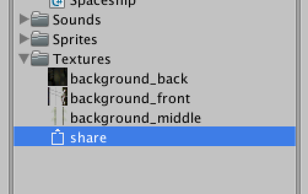
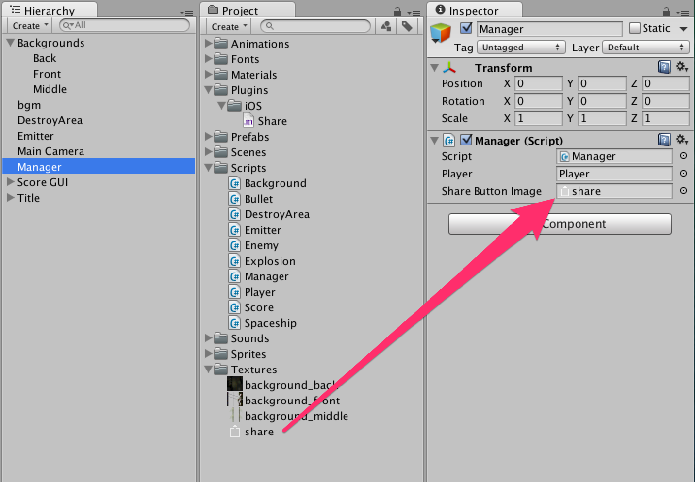
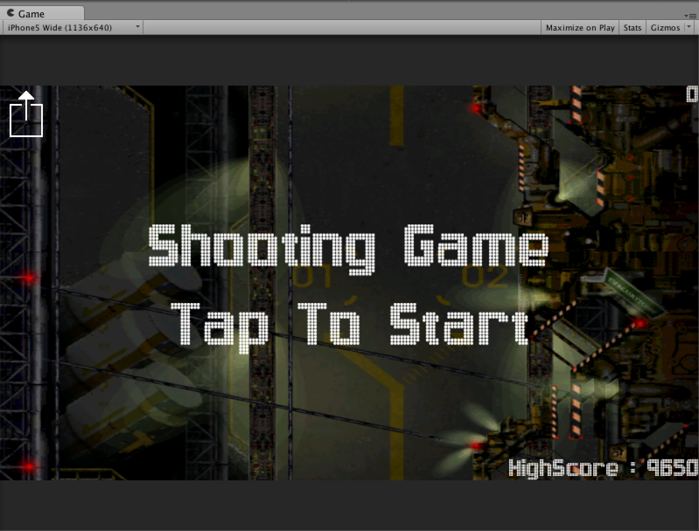
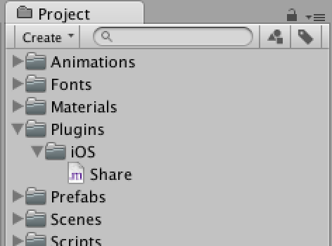
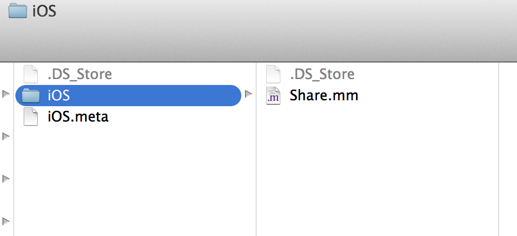
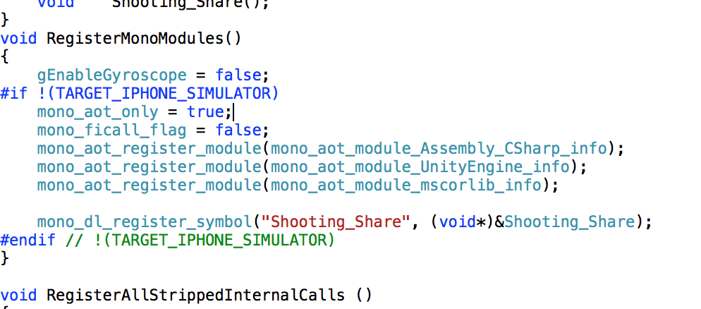
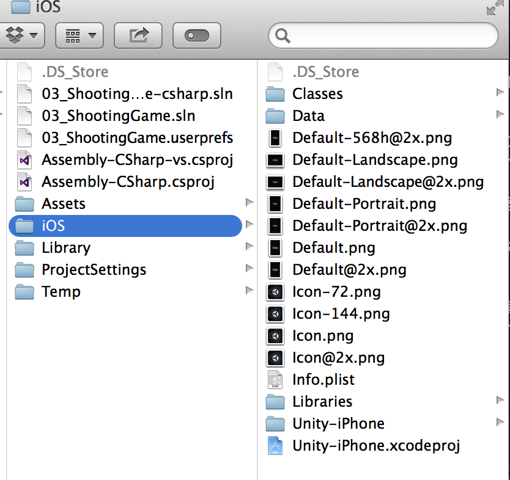
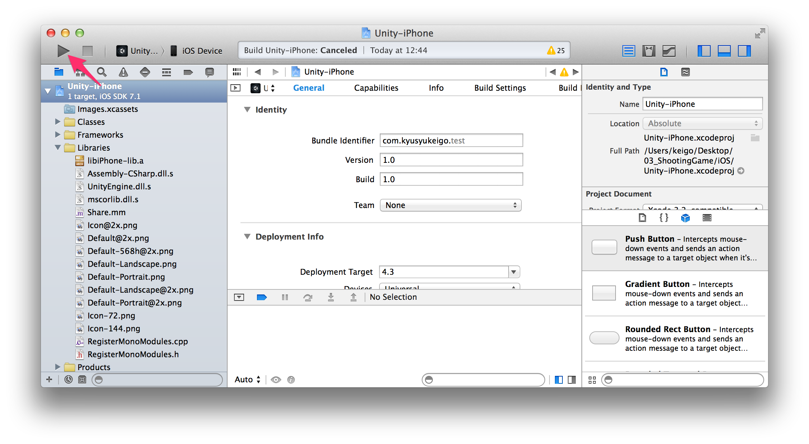

### 使用するプロジェクト

この回はモバイル編第03回終了時点のプロジェクトを使用します。

[モバイル編第03回終了時点のプロジェクトファイルをダウンロード](project/mobile_03_ShootingGame.zip)


### <span id="column-1"></span>プラグインのマニュアルを軽く読んでみよう

この回はプラグインの作り方を、実際に何かを作成しながら覚えるというものです。

詳しい説明は省く可能性がありますので[iOS用のプラグインをビルド](http://docs.unity3d.com/ja/current/Manual/PluginsForIOS.html)を読み返しながらこの回を読んでいきましょう。


<span id="h1-1"></span>1.1　シェア機能を実装する
------------------------------------------------


<br/>図1.1: iOSユーザーはよく見る画面かもしれない


Unityの機能として提供されていないものをプラグインとして実装して利用します。

今回はテキストや画像を簡単に共有できる「UIActivityViewController」を使用します。

### <span id="h1-1-1"></span>Unity側の実装

#### シェアボタンとして使用するテクスチャのダウンロード

[シェアボタンのテクスチャをダウンロード
(右クリックして保存)](project/share.png)

ダウンロードした**share.png**のテクスチャを**Textures**フォルダ下にインポートします。





Manager.csにシェアするボタンとiOS側の処理を呼び出すコードを追加します。


Manager.cs

```cs
using UnityEngine;
using System.Collections;
using System.Runtime.InteropServices;

public class Manager : MonoBehaviour
{
    // Playerプレハブ
    public GameObject player;

    // タイトル
    private GameObject title;

    // シェアのテクスチャ
    public Texture2D shareButtonImage;

    // iOS側のコードを呼び出すための処理
    [DllImport("__Internal")]
    private static extern void Shooting_Share (string text, string url, string textureUrl);

    void Start ()
    {
        // Titleゲームオブジェクトを検索し取得する
        title = GameObject.Find ("Title");
    }

    void OnGUI ()
    {
        // シェアボタンを設置
        if (GUILayout.Button (shareButtonImage, GUIStyle.none, GUILayout.Width (128), GUILayout.Height (128))) {

            // シェアする処理をコルーチンで実行
            StartCoroutine (Share ());
        }

        // ゲーム中ではなく、タッチまたはマウスクリック直後であればtrueを返す。
        if (IsPlaying () == false && Event.current.type == EventType.MouseDown) {
            GameStart ();
        }
    }

    IEnumerator Share ()
    {
        // 現在の画面をキャプチャして名前をscreenShotとして保存する
        Application.CaptureScreenshot ("screenShot.png");

        // キャプチャを保存する処理として１フレーム待つ
        yield return new WaitForEndOfFrame ();

        string text = "2Dシューティング チュートリアル #unity";
        string url = "http://japan.unity3d.com/developer/document/tutorial/2d-shooting-game/ios/01.html";

        // Application.CaptureScreenshotの保存先はApplication.persistentDataPath
        string textureUrl = Application.persistentDataPath + "/screenShot.png";

        // iOS側の処理を呼び出す
        Shooting_Share (text, url, textureUrl);
    }

    void GameStart ()
    {
        // ゲームスタート時に、タイトルを非表示にしてプレイヤーを作成する
        title.SetActive (false);
        Instantiate (player, player.transform.position, player.transform.rotation);
    }

    public void GameOver ()
    {
        FindObjectOfType<Score> ().Save ();
        // ゲームオーバー時に、タイトルを表示する
        title.SetActive (true);
    }

    public bool IsPlaying ()
    {
        // ゲーム中かどうかはタイトルの表示/非表示で判断する
        return title.activeSelf == false;
    }
}
```


shareのテクスチャをManagerゲームオブジェクトの**Share Button
Image**にドラッグ＆ドロップします。





これでゲームを再生すると図1.2のように左上にシェアボタンが表示されます。



<br/>図1.2:


### <span id="column-2"></span>ボタン押したと同時にゲームが開始されてしまうのでは？

今回、Event.current.typeによるマウスクリック判定・タップ判定を行っています。ここで鋭い人は、ボタンを押した時にEvent.current.typeがEventType.MouseDownとなってしまいゲームが開始してしまうのではないかと思うかもしれません。

ですが、実際はゲームは開始されません。これはボタンを押したと同時に、Event.current.typeがEventType.Usedとなり、使用済みイベントとなるからです。これによって他のイベント処理はすべてスキップされ、次のOnGUIの呼び出しから実行されるようになります。


### <span id="h1-1-2"></span>プラグイン側の実装

次にネイティブコード（Objective-C++）を書いていきます。

<br/>図1.3のように**Plugins**フォルダ、**iOS**フォルダを作成し、**Share.mm**ファイルを作成します。

Plugins/iOSフォルダ内にmmファイルを入れておくと、ビルドしたXcodeプロジェクトに自動でファイルを追加してくれます。



<br/>図1.3:


### <span id="column-3"></span>mmファイルの作成

UnityEditor上でmmファイルの作成を行うことは出来ません。なのでFinderやExplorer上でファイルの作成を行ってください。





Share.mmにコードを書いていきます。

技術的な説明はObjective-Cに関する説明になってしまうので簡潔に書くと、

Shooting\_Shareメソッドでは3つの文字列を引数として受け取り、UIActivityViewControllerで扱えるように変換しています。


### <span id="column-4"></span>メソッド名はユニークな名前にしよう

プラグインを作成してUnityでビルド（Xcodeプロジェクト作成）すると自動的に**RegisterMonoModules.cpp**にメソッドが登録されます。RegisterMonoModules.cppはいじらないようにしましょう。

プラグインを作成する時に気をつけて欲しいのが**メソッド名は必ずユニークな名前にする**ということです。

他のプラグインのメソッドも全てRegisterMonoModules.cppで登録されます。ユニークな名前にしないと他のプラグインで使用しているメソッド名とかぶってしまい、エラーが発生したり、別のプラグインのメソッドが呼ばれてしまうということがあります。





Share.mm

```cs
// Unityのバージョンが4.3.4以前であれば
#if UNITY_VERSION <= 434

// Unity4.3.4ではUnityGetGLViewControllerを使用するためにiPhone_Viewのインポートが必要
#import "iPhone_View.h"

#endif

extern "C" {

    void Shooting_Share(const char *text, const char *url, const char *textureURL) {

    // NSStringに変換
    NSString *_text = [NSString stringWithUTF8String:text];
    NSString *_url = [NSString stringWithUTF8String:url];
    NSString *_textureURL = [NSString stringWithUTF8String:textureURL];

    UIImage *image = nil;

    // パスから画像を取得
    if ([_textureURL length] != 0) {
        image = [UIImage imageWithContentsOfFile:_textureURL];
    }

    // テキスト・URL・画像の順に配列を作成する
    NSArray *actItems = [NSArray arrayWithObjects:_text, _url, image, nil];

    // UIActivityViewを作成する
    UIActivityViewController *uiActivityViewController = [[[UIActivityViewController alloc] initWithActivityItems:actItems applicationActivities:nil] autorelease];


    // Unity画面の上にビューを表示させる
    [UnityGetGLViewController() presentViewController:uiActivityViewController animated:YES completion:nil];

    }

}
```


ビルドしてXcodeプロジェクトを作成しましょう。





Xcodeプロジェクトを開き、**Run**ボタンを押して端末へアプリをインストールして実行します。





iOS上でシェアボタンを押したらUIActivityViewが表示されましたか？

最後にゲーム中はシェアボタンを押さないようにManager.csのOnGUIメソッド内を修正します。

他にもバーチャルジョイスティックを追加して操作できるようにして、ハイスコア


Manager.cs

```cs
using UnityEngine;
using System.Collections;
using System.Runtime.InteropServices;

public class Manager : MonoBehaviour
{
    // Playerプレハブ
    public GameObject player;

    // タイトル
    private GameObject title;

    // シェアのテクスチャ
    public Texture2D shareButtonImage;

    // iOS側のコードを呼び出すための処理
    [DllImport("__Internal")]
    private static extern void Shooting_Share (string text, string url, string textureUrl);

    void Start ()
    {
        // Titleゲームオブジェクトを検索し取得する
        title = GameObject.Find ("Title");
    }

    void OnGUI ()
    {
        // ゲーム中でない時
        if (IsPlaying () == false) {
            // シェアボタンを設置
            if (GUILayout.Button (shareButtonImage, GUIStyle.none, GUILayout.Width (128), GUILayout.Height (128))) {

                // シェアする処理をコルーチンで実行
                StartCoroutine (Share ());
            }

            // タッチまたはマウスクリック直後であればtrueを返す。
            if (Event.current.type == EventType.MouseDown) {
                GameStart ();
            }
        }
    }

    IEnumerator Share ()
    {
        // 現在の画面をキャプチャして名前をscreenShotとして保存する
        Application.CaptureScreenshot ("screenShot.png");

        // キャプチャを保存する処理として１フレーム待つ
        yield return new WaitForEndOfFrame ();

        string text = "2Dシューティング チュートリアル #unity";
        string url = "http://japan.unity3d.com/developer/document/tutorial/2d-shooting-game/ios/01.html";

        // Application.CaptureScreenshotの保存先はApplication.persistentDataPath
        string textureUrl = Application.persistentDataPath + "/screenShot.png";

        // iOS側の処理を呼び出す
        Shooting_Share (text, url, textureUrl);
    }

    void GameStart ()
    {
        // ゲームスタート時に、タイトルを非表示にしてプレイヤーを作成する
        title.SetActive (false);
        Instantiate (player, player.transform.position, player.transform.rotation);
    }

    public void GameOver ()
    {
        FindObjectOfType<Score> ().Save ();
        // ゲームオーバー時に、タイトルを表示する
        title.SetActive (true);
    }

    public bool IsPlaying ()
    {
        // ゲーム中かどうかはタイトルの表示/非表示で判断する
        return title.activeSelf == false;
    }
}
```


### 第01回終わり

今回はここで終了です。つまずいてしまった方はプロジェクトファイルをダウンロードして新たな気持ちで次の回へ進みましょう。

[今回のプロジェクトファイルをダウンロード](project/ios_01_ShootingGame.zip)
