<span id="h2-1"></span>2.1　読む前におさえておこう
--------------------------------------------------


### <span id="column-6"></span>Rigidbody2Dクラス

2Dのための物理挙動を行うのに必要なクラスです。重力の影響や、物体の移動はこのクラスを介して行われます。
詳しくはドキュメントの[Rigidbody2D](http://docs.unity3d.com/ja/current/ScriptReference/Rigidbody2D.html)を御覧ください。


### <span id="column-7"></span>Inputクラス

キーボードやJoyStickなどコントローラーの全ての入力を処理するためのクラスです。モバイルなどでは加速度センサーやジャイロにもアクセスすることが出来ます。
詳しくはドキュメントの[Input](http://docs.unity3d.com/ja/current/ScriptReference/Input.html)を御覧ください。


### <span id="column-8"></span>○○をアタッチする

今回のチュートリアルでは、「○○をアタッチする」という言葉を表記していきます。アタッチとは取り付けるという意味で、ゲームオブジェクトにコンポーネントを取り付ける意味として使用することが多いです。
#### <span id="h2-1-0-1"></span>例: Player.csをアタッチする

Playerスクリプトコンポーネントをゲームオブジェクトに取り付けるという意味です。取り付ける方法は様々で3つの方法を教えます。
1.
ヒエラルキーウィンドウにあるゲームオブジェクトにドラッグ＆ドロップしてアタッチする


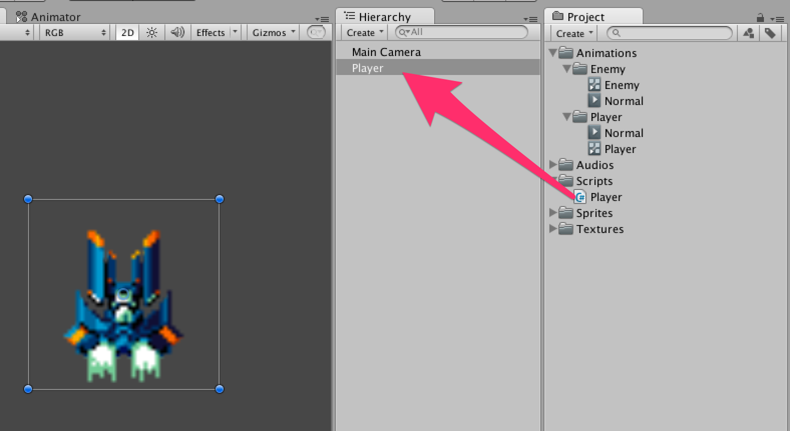
<br/>図2.1:


2\. インスペクターにドラッグ＆ドロップしてアタッチする


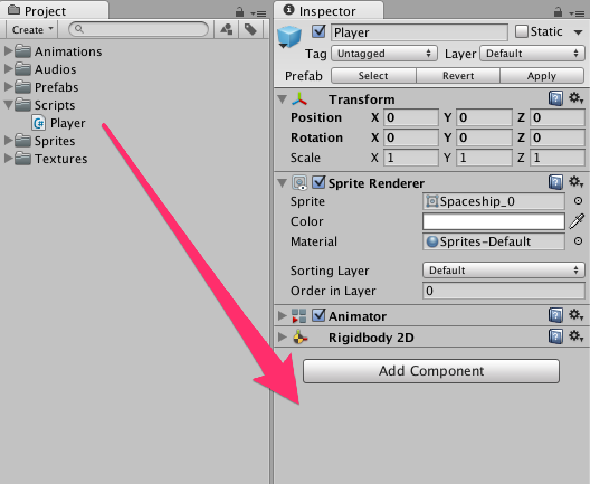
<br/>図2.2:


3\. インスペクターの「Add Component」ボタンを使ってアタッチする


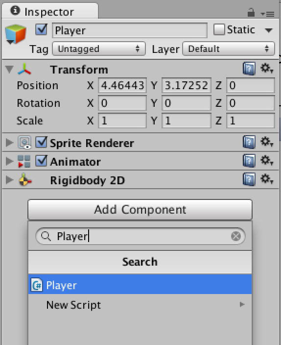
<br/>図2.3:


さっそく操作キャラとなるプレイヤーを動かしてみましょう。
今回はキー入力によってプレイヤーを動かします。キー入力は**スクリプトが必須**で**Input**クラスを使用します。

<span id="h2-2"></span>2.2　Prefabからゲームオブジェクトを作成
--------------------------------------------------------------

PrefabからGameObjectを作成します。


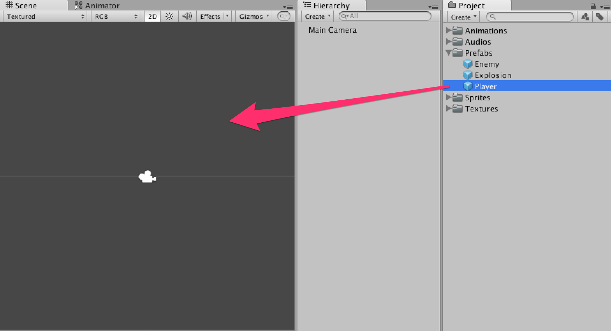
<br/>図2.4:


<span id="h2-3"></span>2.3　プレイヤーを動かす準備
--------------------------------------------------

前章で作成したプレイヤーのゲームオブジェクトに**Rigidbody2D**をアタッチしましょう。
今回は重力の影響は必要ないのでインスペクター上の図2.5のように**Gravity
Scale**を**0**にします。


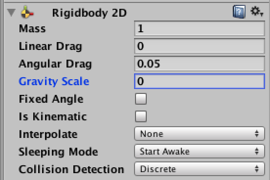
<br/>図2.5: Playerゲームオブジェクトのインスペクター


既にアタッチされている**Animator**を見て、**Apply Root
Motion**にチェックが付いている場合は外してください。


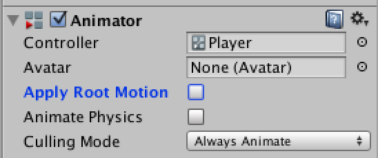
<br/>図2.6:


### <span id="column-9"></span>Apply Root Motionのチェックを外す理由

Apply Root
Motionは3Dモデルに対するアニメーションの制御を行うために使用されます。ですが今回のように2Dゲームを作る場合でもチェックをつけていると影響を受けてしまい、プレイヤーを正しく動かすことが出来ません。


<span id="h2-4"></span>2.4　プレイヤーにスクリプトをアタッチ
------------------------------------------------------------

### <span id="h2-4-1"></span>スクリプトファイルの作成

スクリプトファイルを作成しましょう。`Assets -> Create -> C# Script`を選択し、名前を**Player**とします。


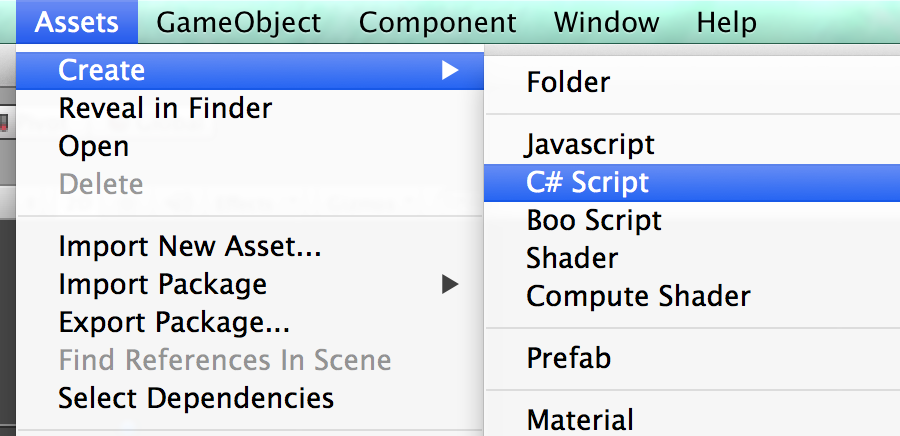
<br/>図2.7:


保存場所は図format\_numberのように**Scripts**フォルダの中に保存するようにしてください。


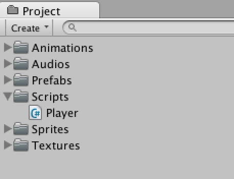


### <span id="h2-4-2"></span>スクリプトを書く

早速コードを書いていきます。Player.csファイルをダブルクリックして**Monodevelop
(モノデベロップ)**を起動しましょう。


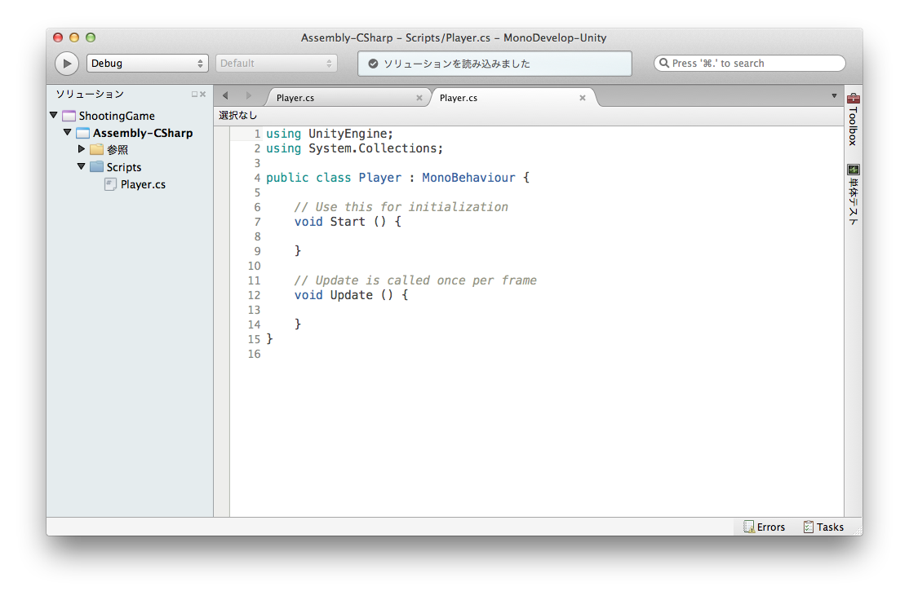


まずプレイヤーの移動は矢印キーの入力によって行い、スクリプトは`Input.GetAxisRaw(string axisName)`を使用します。


### <span id="column-10"></span>Input.GetAxisRaw

矢印キーの左を押せば-1、右を押せば1、何も押さなければ0を取得できます。これはキーボードのような「押す/押さない」の2択しかない場合に使用してください。
アナログスティックのような完全には押し込まず、中途半端な状態が存在する場合は0から1の間の値も検出できる`Input.GetAxis(string axisName)`を使用します。


キー入力によって**プレイヤーの移動する向きと速度
(速度ベクトル)**を**rigidbody2D.velocity**に代入します。


### <span id="column-11"></span>速度ベクトル...??

物体の移動する向きと速さをベクトルで表したものです。
他にも、ベクトルをUnityで使う場面の紹介をドキュメントにて公開しています。[ベクトルのクックブック](http://docs.unity3d.com/ja/current/Manual/VectorCookbook.html)


実装したコードが以下になります。


Player.cs

```cs
using UnityEngine;
using System.Collections;

public class Player : MonoBehaviour
{
    // 移動スピード
    public float speed = 5;

    void Update ()
    {
        // 右・左
        float x = Input.GetAxisRaw ("Horizontal");

        // 上・下
        float y = Input.GetAxisRaw ("Vertical");

        // 移動する向きを求める
        Vector2 direction = new Vector2 (x, y).normalized;

        // 移動する向きとスピードを代入する
        rigidbody2D.velocity = direction * speed;
    }
}
```


### <span id="h2-4-3"></span>プレイヤーにスクリプトをアタッチする

先ほど作成した`Player.cs`をプレイヤーにアタッチします。スクリプトをプレイヤーのゲームオブジェクトにドラッグ＆ドロップしてください。


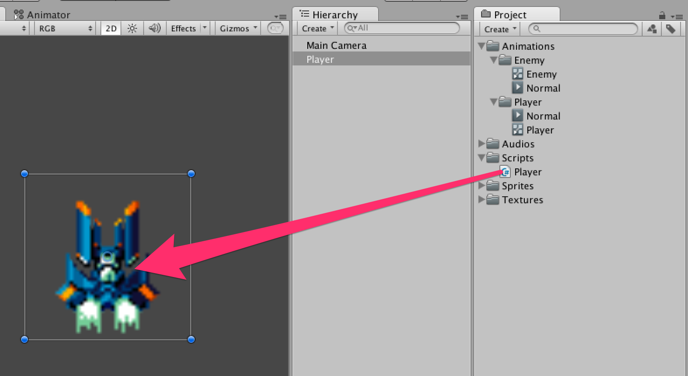
<br/>図2.8:


### <span id="h2-4-4"></span>**Main Camera (メインカメラ)**の調整

ここで、ゲームを再生してプレイヤーが動くか確認する前に、カメラの調整を行います。これはゲーム画面で見える範囲を調整するためです。
Projectionを**Orthographic**に、Sizeを**3**にします。


<br/>図2.9: Main Cameraのインスペクター


スクリプトのアタッチとカメラの調整が終わったらゲームを再生して矢印キーを押してみましょう。動きましたか？

### <span id="h2-4-5"></span>シーンを保存する

今までシーンで作成したものを**Scene**ファイルとして保存します。
`Scenes`フォルダを作成し、メニューの`「File → Save Scene」`を選択してください。
シーン名は**Stage**とします。


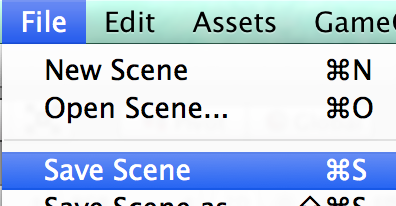
<br/>図2.10:


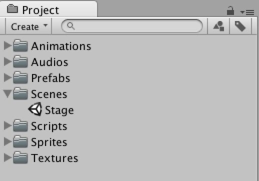
<br/>図2.11:


### 第02回終わり

今回はここで終了です。つまずいてしまった方はプロジェクトファイルをダウンロードして新たな気持ちで次の回へ進みましょう。

[今回のプロジェクトファイルをダウンロード](project/game_02_ShootingGame.zip)
