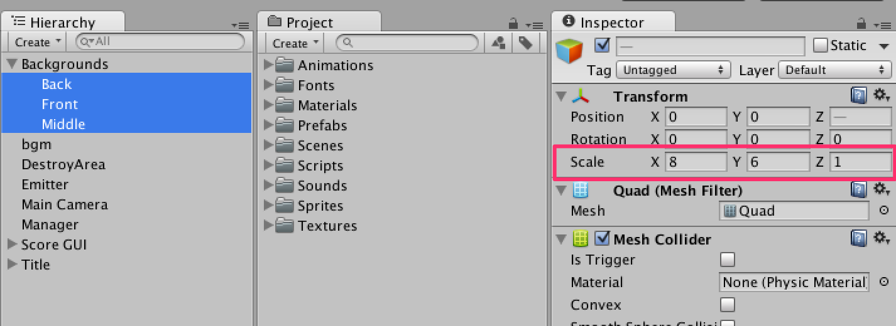
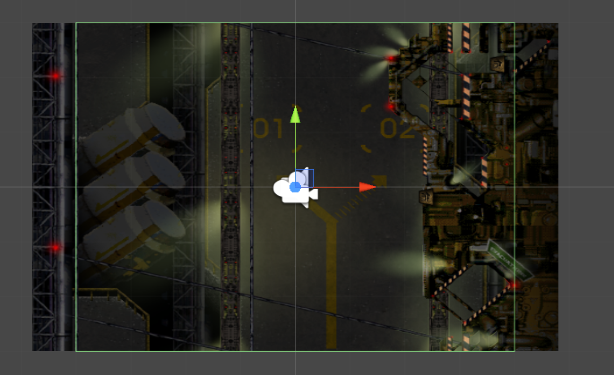
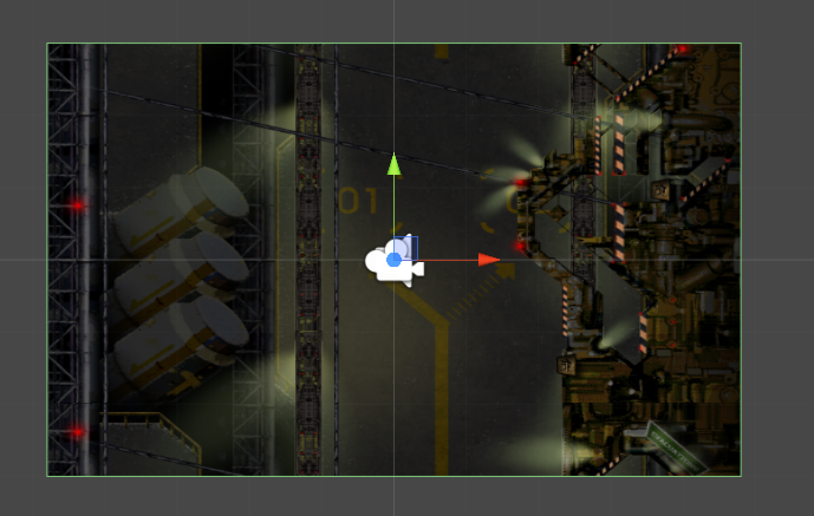

### 使用するプロジェクト

この回はゲーム制作編第12回終了時点のプロジェクトを使用します。

[ゲーム制作編第12回のプロジェクトファイルをダウンロード](project/game_12_ShootingGame.zip)

<span id="h2-1"></span>2.1　ゲームビューの画面サイズ変更
--------------------------------------------------------

まず`File → Project Settings...`で**Platform**をAndroidまたはiOSに変更しましょう。今回はAndroidへ変更を行います。


次にゲームビューの画面サイズを**16:10 Landscape (16:10)**にしましょう。


<br/>図2.1のように青色の背景が見えていたら正常です。


<br/>図2.1: カメラの見える範囲が広くなった状態


<span id="h2-2"></span>2.2　BackgroundとDestroyAreaの変更
---------------------------------------------------------

今回は、画面サイズの変更によるBackgroundsとDestroyAreaの修正を「引き伸ばす」事によって対応します。

### <span id="h2-2-1"></span>Backgroundのスケール変更



<br/>図2.2: Front, Middle, Backそれぞれのスケール


**Background.cs**にコードを追加して、スケールを画面サイズに合わせるように変更します。


Background.cs

```cs
using UnityEngine;

public class Background : MonoBehaviour
{
    // スクロールするスピード
    public float speed = 0.1f;

    void Start ()
    {
        // 画面右上のワールド座標をビューポートから取得
        Vector2 max = Camera.main.ViewportToWorldPoint (new Vector2 (1, 1));

        // スケールを求める。
        Vector2 scale = max * 2;

        // スケールを変更。
        transform.localScale = scale;
    }

    void Update ()
    {
        // 時間によってYの値が0から1に変化していく。1になったら0に戻り、繰り返す。
        float y = Mathf.Repeat (Time.time * speed, 1);

        // Yの値がずれていくオフセットを作成
        Vector2 offset = new Vector2 (0, y);

        // マテリアルにオフセットを設定する
        renderer.sharedMaterial.SetTextureOffset ("_MainTex", offset);
    }
}
```


ゲームを再生してみましょう。ゲーム再生直後に背景が画面いっぱいに広がるはずです。


### <span id="h2-2-2"></span>DestroyAreaのスケール変更



<br/>図2.3: 変更前のDestroyArea


DestroyAreaもBackgroundと同じようにスケールを変更していきます。


DestroyArea.cs

```cs
using UnityEngine;

public class DestroyArea : MonoBehaviour
{
    void Start ()
    {
        // 画面右上のワールド座標をビューポートから取得
        Vector2 max = Camera.main.ViewportToWorldPoint (new Vector2 (1, 1));

        // サイズを求める
        Vector2 size = max * 2;

        // BoxCollider2Dのサイズを変更
        GetComponent<BoxCollider2D> ().size = size;

    }

    void OnTriggerExit2D (Collider2D c)
    {
        Destroy (c.gameObject);
    }
}
```





### 第02回終わり

今回はここで終了です。つまずいてしまった方はプロジェクトファイルをダウンロードして新たな気持ちで次の回へ進みましょう。

[今回のプロジェクトファイルをダウンロード](project/mobile_02_ShootingGame.zip)
