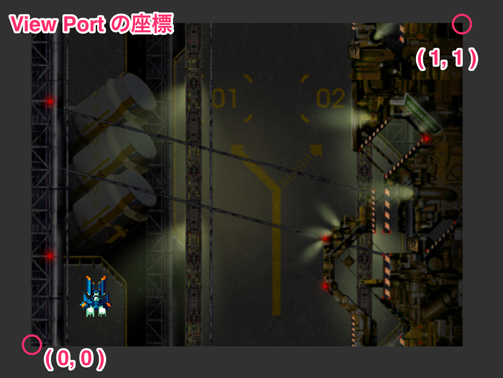
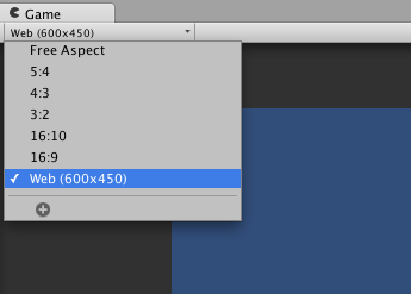
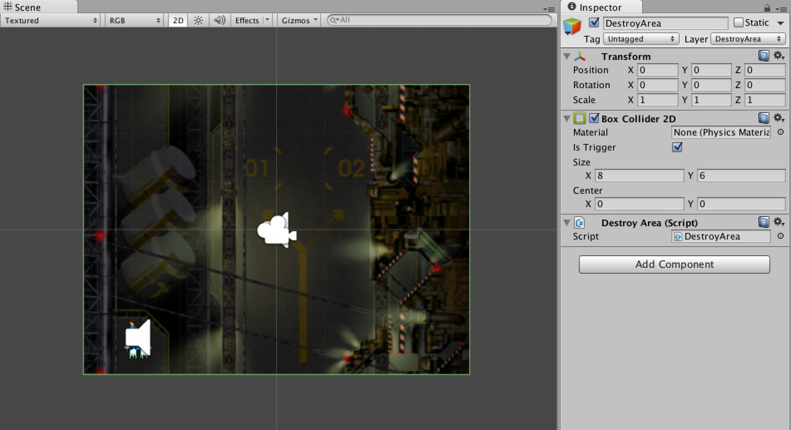
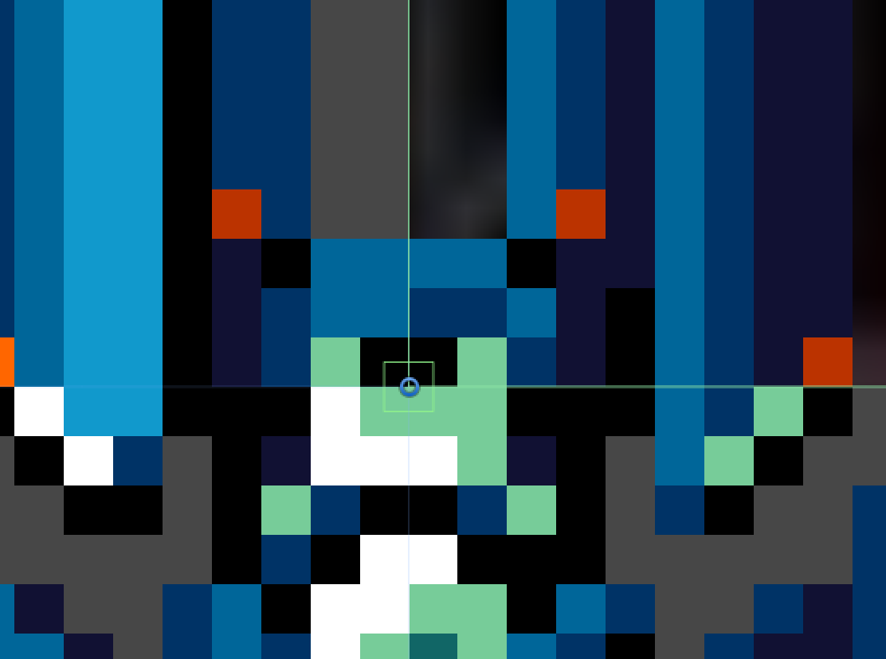

前章では音を付けました。
この章では小さなことですが、実装や修正した方が良い部分を説明していきます。

<span id="h9-1"></span>9.1　プレイヤーに移動制限つける
------------------------------------------------------

今のままではプレイヤーは画面外へ移動できてしまいます。これを画面内のみ移動できるようにしましょう。
今回は移動の制限にカメラのビューポートとMathf.Clampを使用します。

<div class="column">

### <span id="column-29"></span>**View Port (ビューポート)**

カメラが映る範囲のことを指します。ビューポートでは正規化された値を使用するので範囲は0から1の間となります。
普段は画面いっぱいに表示されるので値は **X 0 Y 0 Width 1 Height 1**
となります。
<div class="image">



</div>

詳しくはドキュメントの[Camera](//docs-jp.unity3d.com/Documentation/Components/class-Camera.html)を御覧ください。

</div>

これから実装するプレイヤーの移動制限は**ゲームの画面サイズが600x450**でなければうまく動作しません。もう一度正しく設定されているか確認しましょう。

<div class="image">



</div>

### <span id="h9-1-1"></span>DestroyAreaの範囲を修正する

DestroyAreaの範囲を背景やカメラの表示範囲と同じにします。**Box Collider
2D**の**Sizeを X 8 Y 6**にします。

<div class="image">


図9.1: 背景とカメラのと同じ範囲

</div>

### <span id="h9-1-2"></span>プレイヤーの移動方法を変更

ここでプレイヤーの移動方法を変更します。
プレイヤーの移動制限を行うのにMathf.Clampを使用しますが、これは**transform.position**の位置情報を使用して制限を行います。
ですが自動で位置情報を更新する物理挙動（今回はrigidbody2D.velocity）とMathf.Clampでの移動制限を行うと、不都合なことが起こります。
それは、物理挙動によって移動した後に移動制限をかけなければいけないということです。つまり**一度移動範囲外に出た後、範囲内に強制的に移動する**事になります。
その状態を確認してみましょう。
**Player.cs**に移動制限のコードを追加します(Clampメソッド)

<div class="source-code">

Player.cs

``` {.source}
using UnityEngine;
using System.Collections;

public class Player : MonoBehaviour
{
        // Spaceshipコンポーネント
        Spaceship spaceship;

        IEnumerator Start ()
        {
                // Spaceshipコンポーネントを取得
                spaceship = GetComponent<Spaceship> ();

                while (true) {

                        // 弾をプレイヤーと同じ位置/角度で作成
                        spaceship.Shot (transform);

                        // ショット音を鳴らす
                        audio.Play();

                        // shotDelay秒待つ
                        yield return new WaitForSeconds (spaceship.shotDelay);
                }
        }

        void Update ()
        {
                // 右・左
                float x = Input.GetAxisRaw ("Horizontal");

                // 上・下
                float y = Input.GetAxisRaw ("Vertical");

                // 移動する向きを求める
                Vector2 direction = new Vector2 (x, y).normalized;

                // 移動
                spaceship.Move (direction);

                // 移動の制限
                Clamp();
        }

        void Clamp ()
        {
                // 画面左下のワールド座標をビューポートから取得
                Vector2 min = Camera.main.ViewportToWorldPoint(new Vector2(0, 0));

                // 画面右上のワールド座標をビューポートから取得
                Vector2 max = Camera.main.ViewportToWorldPoint(new Vector2(1, 1));

                // プレイヤーの座標を取得
                Vector2 pos = transform.position;

                // プレイヤーの位置が画面内に収まるように制限をかける
                pos.x = Mathf.Clamp (pos.x, min.x, max.x);
                pos.y = Mathf.Clamp (pos.y, min.y, max.y);

                // 制限をかけた値をプレイヤーの位置とする
                transform.position = pos;
        }

        // ぶつかった瞬間に呼び出される
        void OnTriggerEnter2D (Collider2D c)
        {
                // レイヤー名を取得
                string layerName = LayerMask.LayerToName(c.gameObject.layer);

                // レイヤー名がBullet (Enemy)の時は弾を削除
                if( layerName == "Bullet (Enemy)")
                {
                        // 弾の削除
                        Destroy(c.gameObject);
                }

                // レイヤー名がBullet (Enemy)またはEnemyの場合は爆発
                if( layerName == "Bullet (Enemy)" || layerName == "Enemy")
                {
                        // 爆発する
                        spaceship.Explosion();

                        // プレイヤーを削除
                        Destroy (gameObject);
                }
        }
}
```

</div>

この状態で、ゲームを再生して画面端に移動してみてください。プレイヤーが削除されるはずです。
図9.2は画面端（-4,-3）に移動した時の画像です。本来であればプレイヤーのコライダーはDestroyAreaのコライダー内に含まれているので**OnTriggerExit2D**は呼ばれないはずですが、呼ばれてしまいます。これは、**DeastoryAreaのコライダー外に移動してしまっている**事になります。

<div class="image">


図9.2:

</div>

そこで、プレイヤーの移動は**rigidbody2D.velocity**を使用せず、**transform.position**のみで行うようにします。

<div class="source-code">

Player.cs

``` {.source}
using UnityEngine;
using System.Collections;

public class Player : MonoBehaviour
{
        // Spaceshipコンポーネント
        Spaceship spaceship;

        IEnumerator Start ()
        {
                // Spaceshipコンポーネントを取得
                spaceship = GetComponent<Spaceship> ();

                while (true) {

                        // 弾をプレイヤーと同じ位置/角度で作成
                        spaceship.Shot (transform);

                        // ショット音を鳴らす
                        audio.Play();

                        // shotDelay秒待つ
                        yield return new WaitForSeconds (spaceship.shotDelay);
                }
        }

        void Update ()
        {
                // 右・左
                float x = Input.GetAxisRaw ("Horizontal");

                // 上・下
                float y = Input.GetAxisRaw ("Vertical");

                // 移動する向きを求める
                Vector2 direction = new Vector2 (x, y).normalized;

                // 移動の制限
                Move (direction);

        }

        // 機体の移動
        void Move (Vector2 direction)
        {
                // 画面左下のワールド座標をビューポートから取得
                Vector2 min = Camera.main.ViewportToWorldPoint(new Vector2(0, 0));

                // 画面右上のワールド座標をビューポートから取得
                Vector2 max = Camera.main.ViewportToWorldPoint(new Vector2(1, 1));

                // プレイヤーの座標を取得
                Vector2 pos = transform.position;

                // 移動量を加える
                pos += direction  * spaceship.speed * Time.deltaTime;

                // プレイヤーの位置が画面内に収まるように制限をかける
                pos.x = Mathf.Clamp (pos.x, min.x, max.x);
                pos.y = Mathf.Clamp (pos.y, min.y, max.y);

                // 制限をかけた値をプレイヤーの位置とする
                transform.position = pos;
        }

        // ぶつかった瞬間に呼び出される
        void OnTriggerEnter2D (Collider2D c)
        {
                // レイヤー名を取得
                string layerName = LayerMask.LayerToName(c.gameObject.layer);

                // レイヤー名がBullet (Enemy)の時は弾を削除
                if( layerName == "Bullet (Enemy)")
                {
                        // 弾の削除
                        Destroy(c.gameObject);
                }

                // レイヤー名がBullet (Enemy)またはEnemyの場合は爆発
                if( layerName == "Bullet (Enemy)" || layerName == "Enemy")
                {
                        // 爆発する
                        spaceship.Explosion();

                        // プレイヤーを削除
                        Destroy (gameObject);
                }
        }
}
```

</div>

ゲームを再生してみてください。プレイヤーが画面外へ移動しなくなり、**OnTriggerExit2D**が呼ばれなくなります。

<div class="column">

### <span id="column-30"></span>この方法はDestroyAreaとPlayerの間に当たり判定は検出されない

今回Transformの位置を直接変更する移動方法に変更しました。このことでDestroyAreaとPlayerの間では当たり判定は発生しなくなります。これはRigidbody2Dの物理挙動によって移動を行わなくなったためです。

</div>

<span id="h9-2"></span>9.2　Spaceship.csとEnemy.csの修正
--------------------------------------------------------

Player.csとEnemy.cs共通の処理を記述しているSpaceship.csにMoveメソッドがありますが、Player.csで使用しなくなったので修正を行います。

<div class="source-code">

Spaceship.cs

``` {.source}
using UnityEngine;

[RequireComponent(typeof(Rigidbody2D))]
public class Spaceship : MonoBehaviour
{
        // 移動スピード
        public float speed;

        // 弾を撃つ間隔
        public float shotDelay;

        // 弾のPrefab
        public GameObject bullet;

        // 弾を撃つかどうか
        public bool canShot;

        // 爆発のPrefab
        public GameObject explosion;

        // 爆発の作成
        public void Explosion ()
        {
                Instantiate (explosion, transform.position, transform.rotation);
        }

        // 弾の作成
        public void Shot (Transform origin)
        {
                Instantiate (bullet, origin.position, origin.rotation);
        }
}
```

</div>

<div class="source-code">

Enemy.cs

``` {.source}
using UnityEngine;
using System.Collections;

public class Enemy : MonoBehaviour
{
        // Spaceshipコンポーネント
        Spaceship spaceship;

        IEnumerator Start ()
        {

                // Spaceshipコンポーネントを取得
                spaceship = GetComponent<Spaceship> ();

                // ローカル座標のY軸のマイナス方向に移動する
                Move (transform.up * -1);

                // canShotがfalseの場合、ここでコルーチンを終了させる
                if (spaceship.canShot == false) {
                        yield break;
                }

                while (true) {

                        // 子要素を全て取得する
                        for (int i = 0; i < transform.childCount; i++) {

                                Transform shotPosition = transform.GetChild (i);

                                // ShotPositionの位置/角度で弾を撃つ
                                spaceship.Shot (shotPosition);
                        }

                        // shotDelay秒待つ
                        yield return new WaitForSeconds (spaceship.shotDelay);
                }
        }

        // 機体の移動
        public void Move (Vector2 direction)
        {
                rigidbody2D.velocity = direction * spaceship.speed;
        }

        void OnTriggerEnter2D (Collider2D c)
        {
                // レイヤー名を取得
                string layerName = LayerMask.LayerToName (c.gameObject.layer);

                // レイヤー名がBullet (Player)以外の時は何も行わない
                if (layerName != "Bullet (Player)") return;

                // 弾の削除
                Destroy(c.gameObject);

                // 爆発
                spaceship.Explosion ();

                // エネミーの削除
                Destroy (gameObject);
        }
}
```

</div>

<div class="column">

### <span id="column-31"></span>プログラマーならこのように実装するのもアリ

Spaceship.csを抽象クラスとして扱うのが適切な方法かもしれません。ですが、プログラマー以外の混乱を避けるため今回のチュートリアルはその方法では実装しません。
<div class="source-code">

Spaceship.cs

``` {.source}
using UnityEngine;

[RequireComponent(typeof(Rigidbody2D))]
public abstract class Spaceship : MonoBehaviour
{
        // 移動スピード
        public float speed;

        // 弾を撃つ間隔
        public float shotDelay;

        // 弾のPrefab
        public GameObject bullet;

        // 弾を撃つかどうか
        public bool canShot;

        // 爆発のPrefab
        public GameObject explosion;

        // 爆発の作成
        public void Explosion ()
        {
                Instantiate (explosion, transform.position, transform.rotation);
        }

        // 弾の作成
        public void Shot (Transform origin)
        {
                Instantiate (bullet, origin.position, origin.rotation);
        }

        protected abstract void Move (Vector2 direction);
}
```

</div>

</div>

### 第09回終わり

今回はここで終了です。つまずいてしまった方はプロジェクトファイルをダウンロードして新たな気持ちで次の回へ進みましょう。

[今回のプロジェクトファイルをダウンロード](./project/game_09_ShootingGame.zip)
