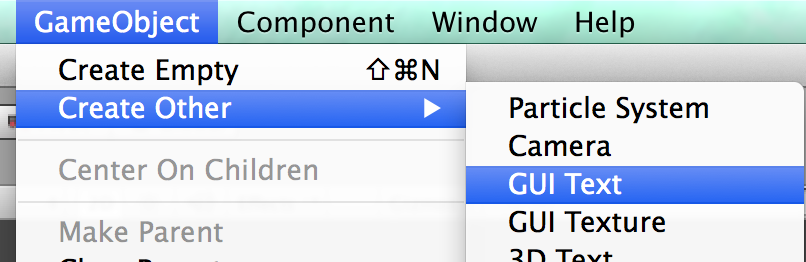
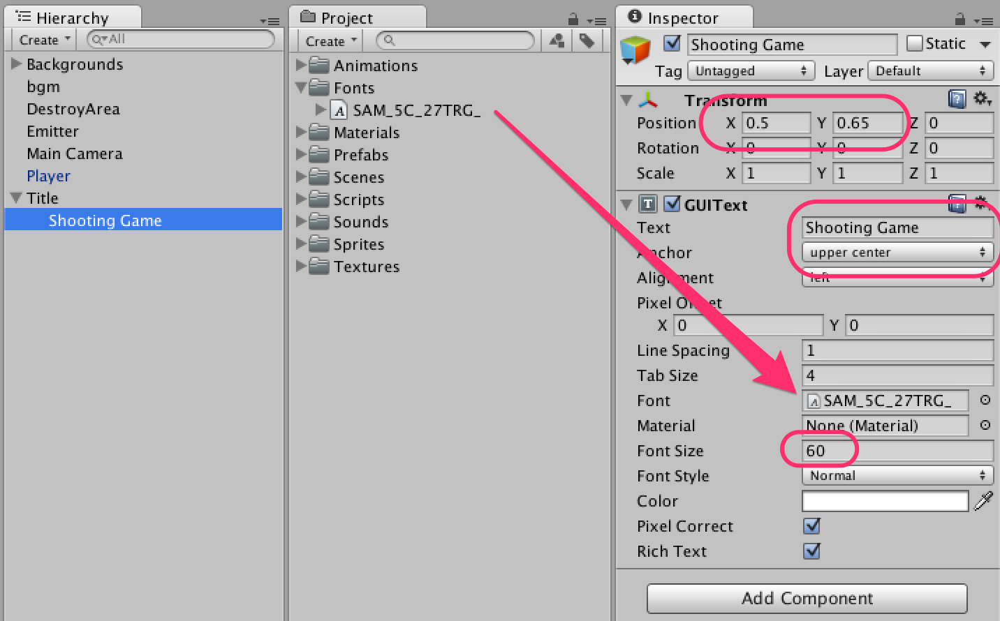
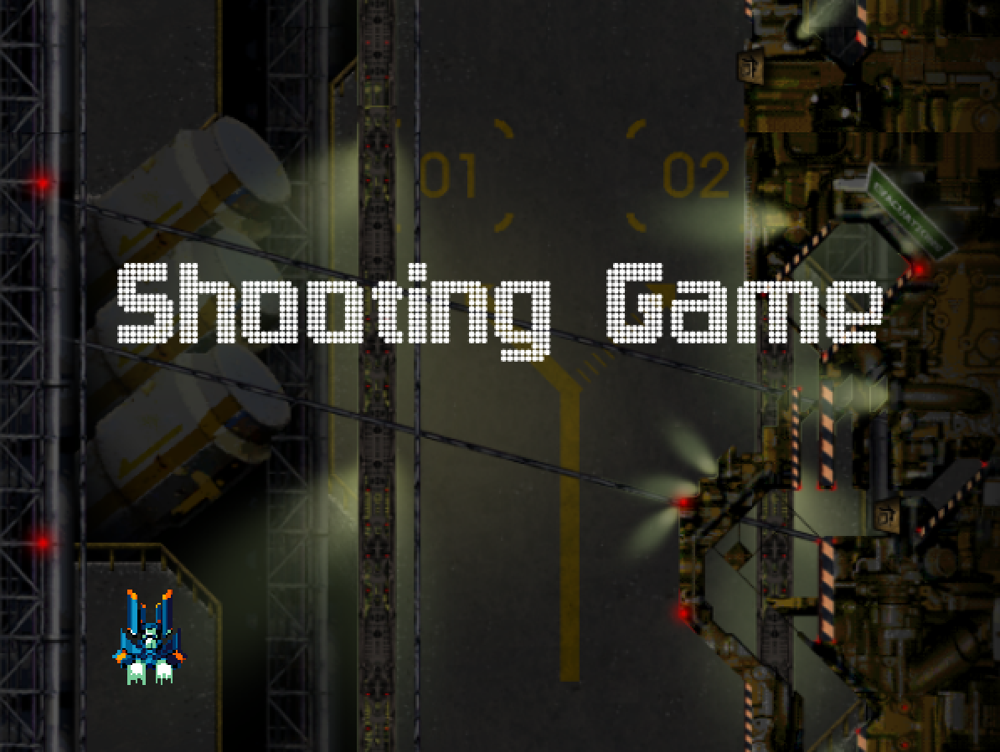
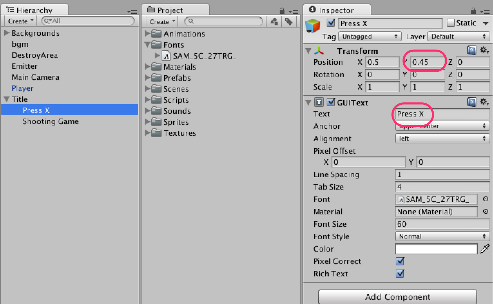
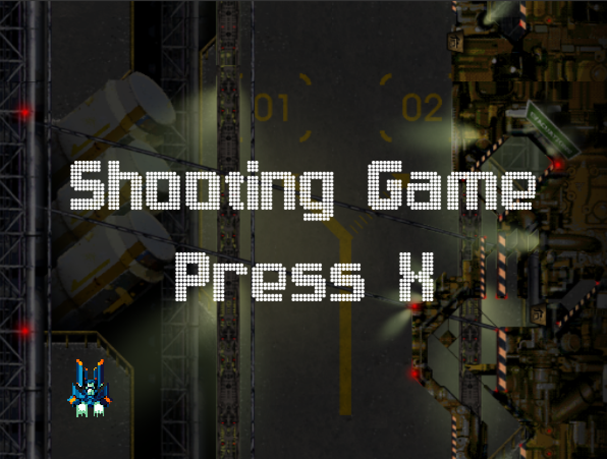
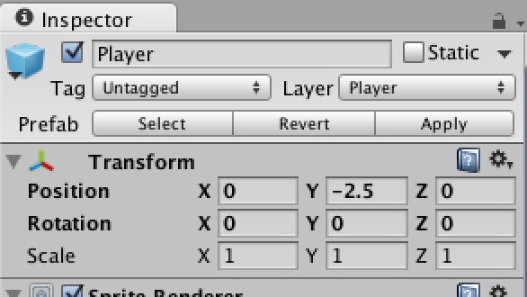
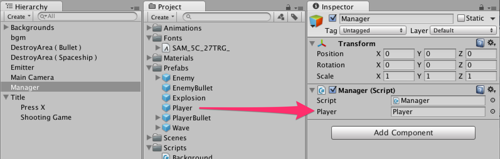

ゲームを開始する前にタイトル画面を表示します。

<span id="h10-1"></span>10.1　タイトルの表示
--------------------------------------------

空のゲームオブジェクトを作成し、名前を**Title**とします。Titleゲームオブジェクトの**位置はX
0 Y 0 Z 0**とします。
次に、メニューの`GameObject -> Create Other -> GUI Text`を選択し、GUIテキストを作成します。名前を**Shooting
Game**として、Titleの子要素とします。





Titleの子要素とした**Shooting Game**のパラメータを設定していきます。
**Shooting Game**の**位置はX 0.5 Y 0.65 Z 0**とします。
**Textを「Shooting Game」**、**Anchorを「upper
center」**、`Fonts`フォルダの**SAM\_5C\_27TRG\_**を**Font**へ格納、**Font
Sizeを「60」**とします。





<br/>図10.1のように表示されているはずです。



<br/>図10.1:


次に**Shooting Game**ゲームオブジェクトをDuplicateして、名前を**Press
X**とします。 **Shooting
Game**ゲームオブジェクトと変更する部分は**位置のYを0.45**、**Textを「Press
X」**になります。





<br/>図10.2のように表示されれば問題ありません。



<br/>図10.2:


<span id="h10-2"></span>10.2　タイトル -\> ゲームスタート ( -\> 死んだら ) -\> タイトル のマネージャークラスを作る
------------------------------------------------------------------------------------------------------------------

タイトル表示中はプレイヤーやWaveの作成を行わないようにします。

### <span id="h10-2-1"></span>Playerゲームオブジェクトの削除

まずはPlayerの**位置を X 0 Y -2.5 Z
0**にしてプレハブを更新して、Playerゲームオブジェクトを削除してください。





### <span id="h10-2-2"></span>Managerの作成

空のゲームオブジェクトを作成し、名前を**Manager**とします。
次に**Manager.cs**を`Scripts`フォルダの中に作成します。


Manager.cs

```cs
using UnityEngine;

public class Manager : MonoBehaviour
{
    // Playerプレハブ
    public GameObject player;

    // タイトル
    private GameObject title;

    void Start ()
    {
        // Titleゲームオブジェクトを検索し取得する
        title = GameObject.Find ("Title");
    }

    void Update ()
    {
        // ゲーム中ではなく、Xキーが押されたらtrueを返す。
        if (IsPlaying () == false && Input.GetKeyDown (KeyCode.X)) {
            GameStart ();
        }
    }

    void GameStart ()
    {
        // ゲームスタート時に、タイトルを非表示にしてプレイヤーを作成する
        title.SetActive (false);
        Instantiate (player, player.transform.position, player.transform.rotation);
    }

    public void GameOver ()
    {
        // ゲームオーバー時に、タイトルを表示する
        title.SetActive (true);
    }

    public bool IsPlaying ()
    {
        // ゲーム中かどうかはタイトルの表示/非表示で判断する
        return title.activeSelf == false;
    }
}
```


### <span id="h10-2-3"></span>マネージャーにPlayerプレハブの設定





<span id="h10-3"></span>10.3　他のスクリプトからマネージャーを呼び出す
----------------------------------------------------------------------

Player.csを修正します。


Player.cs

```cs
using UnityEngine;
using System.Collections;

public class Player : MonoBehaviour
{
    // Spaceshipコンポーネント
    Spaceship spaceship;

    IEnumerator Start ()
    {
        // Spaceshipコンポーネントを取得
        spaceship = GetComponent<Spaceship> ();

        while (true) {

            // 弾をプレイヤーと同じ位置/角度で作成
            spaceship.Shot (transform);

            // ショット音を鳴らす
            audio.Play();

            // shotDelay秒待つ
            yield return new WaitForSeconds (spaceship.shotDelay);
        }
    }

    void Update ()
    {
        // 右・左
        float x = Input.GetAxisRaw ("Horizontal");

        // 上・下
        float y = Input.GetAxisRaw ("Vertical");

        // 移動する向きを求める
        Vector2 direction = new Vector2 (x, y).normalized;

        // 移動の制限
        Move (direction);

    }

    // 機体の移動
    void Move (Vector2 direction)
    {
        // 画面左下のワールド座標をビューポートから取得
        Vector2 min = Camera.main.ViewportToWorldPoint(new Vector2(0, 0));

        // 画面右上のワールド座標をビューポートから取得
        Vector2 max = Camera.main.ViewportToWorldPoint(new Vector2(1, 1));

        // プレイヤーの座標を取得
        Vector2 pos = transform.position;

        // 移動量を加える
        pos += direction  * spaceship.speed * Time.deltaTime;

        // プレイヤーの位置が画面内に収まるように制限をかける
        pos.x = Mathf.Clamp (pos.x, min.x, max.x);
        pos.y = Mathf.Clamp (pos.y, min.y, max.y);

        // 制限をかけた値をプレイヤーの位置とする
        transform.position = pos;
    }

    // ぶつかった瞬間に呼び出される
    void OnTriggerEnter2D (Collider2D c)
    {
        // レイヤー名を取得
        string layerName = LayerMask.LayerToName(c.gameObject.layer);

        // レイヤー名がBullet (Enemy)の時は弾を削除
        if( layerName == "Bullet (Enemy)")
        {
            // 弾の削除
            Destroy(c.gameObject);
        }

        // レイヤー名がBullet (Enemy)またはEnemyの場合は爆発
        if( layerName == "Bullet (Enemy)" || layerName == "Enemy")
        {
            // Managerコンポーネントをシーン内から探して取得し、GameOverメソッドを呼び出す
            FindObjectOfType<Manager>().GameOver();

            // 爆発する
            spaceship.Explosion();

            // プレイヤーを削除
            Destroy (gameObject);
        }
    }
}
```


Emitter.csを修正します。


Emitter.cs

```cs
using UnityEngine;
using System.Collections;

public class Emitter : MonoBehaviour
{
    // Waveプレハブを格納する
    public GameObject[] waves;

    // 現在のWave
    private int currentWave;

    // Managerコンポーネント
    private Manager manager;

    IEnumerator Start ()
    {

        // Waveが存在しなければコルーチンを終了する
        if (waves.Length == 0) {
            yield break;
        }

        // Managerコンポーネントをシーン内から探して取得する
        manager = FindObjectOfType<Manager>();

        while (true) {

            // タイトル表示中は待機
            while(manager.IsPlaying() == false) {
                yield return new WaitForEndOfFrame ();
            }

            // Waveを作成する
            GameObject g = (GameObject)Instantiate (waves [currentWave], transform.position, Quaternion.identity);

            // WaveをEmitterの子要素にする
            g.transform.parent = transform;

            // Waveの子要素のEnemyが全て削除されるまで待機する
            while (g.transform.childCount != 0) {
                yield return new WaitForEndOfFrame ();
            }

            // Waveの削除
            Destroy (g);

            // 格納されているWaveを全て実行したらcurrentWaveを0にする（最初から -> ループ）
            if (waves.Length <= ++currentWave) {
                currentWave = 0;
            }

        }
    }
}
```


さて、ゲームを再生してみてください。タイトル表示中はプレイヤーも敵も出てませんか？Xキーを押すとゲームが開始されますか？

### 第10回終わり

今回はここで終了です。つまずいてしまった方はプロジェクトファイルをダウンロードして新たな気持ちで次の回へ進みましょう。

[今回のプロジェクトファイルをダウンロード](project/game_10_ShootingGame.zip)
