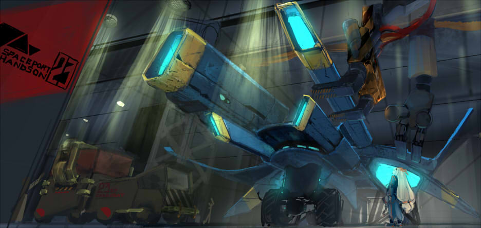

1.1　必要なもの
--------------------------------------

### Unity

[Unityをダウンロード](http://japan.unity3d.com/unity/download/)

### チュートリアルで使用するプロジェクト

[今回のプロジェクトファイルをダウンロード](https://github.com/unity3d-jp-tutorials/2d-shooting-game/archive/master.zip)

1.2　Unityの操作に慣れよう
-------------------------------------------------

このチュートリアルを行う前に、まずはUnityの基本を学びましょう。

マニュアルの[Unityの概要](http://docs.unity3d.com/ja/current/Manual/LearningtheInterface.html)へ移動する

1.3　Unityを起動しよう
---------------------------------------------

先程ダウンロードしたzipを解凍してUnityプロジェクトとして開きましょう。

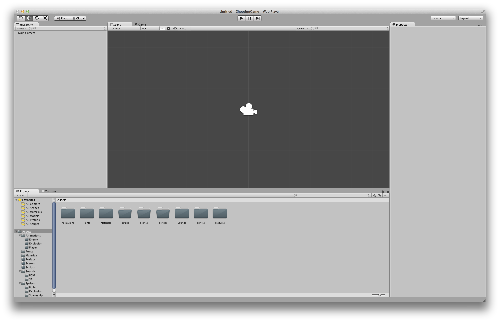
 図1.1: Unityを起動した状態

### Unityを起動する

Macであれば`アプリケーション`にインストールされるUnity.appを、Windowsであればデスクトップに作成されるUnity.exeのショートカットをダブルクリックして開きます。

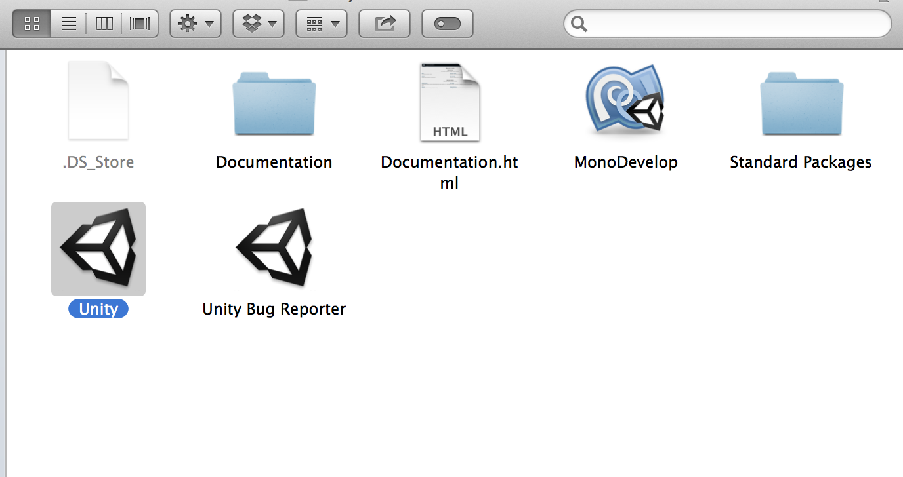
 図1.2:

### 開くプロジェクトを選択

**Project
Wizard**が開くので`Open Other`ボタンをクリックしましょう。

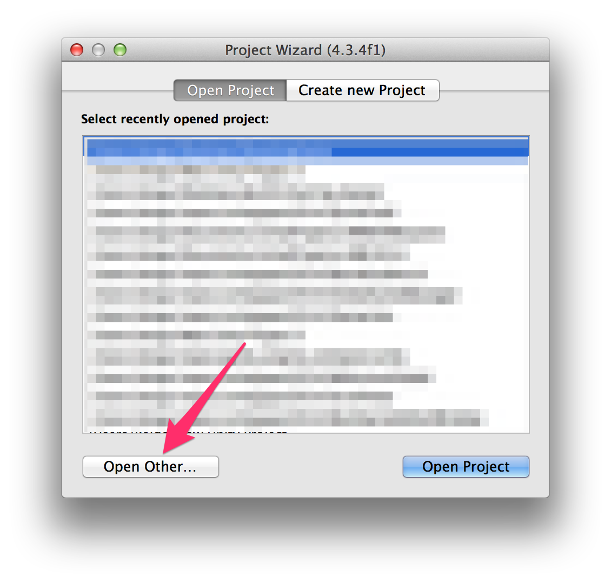

`ShootingGame`フォルダを選択してUnityプロジェクトを開きます。

1.4　チュートリアルをやるために環境を整える
------------------------------------------------------------------

今から快適にチュートリアルを行うためにUnityの環境を図1.3と同じにします。

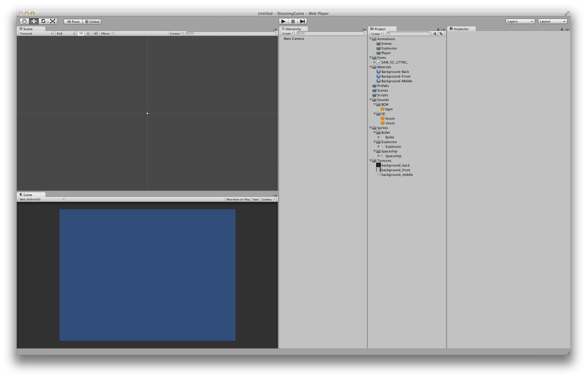
 図1.3: チュートリアルでのUnity環境

### レイアウトの変更

#### Unityのレイアウト変更

Unityの「見た目」を同じにするためにレイアウトを変更します。**右上**にあるLayoutボタンをクリックして**2
by 3**を選択してください。

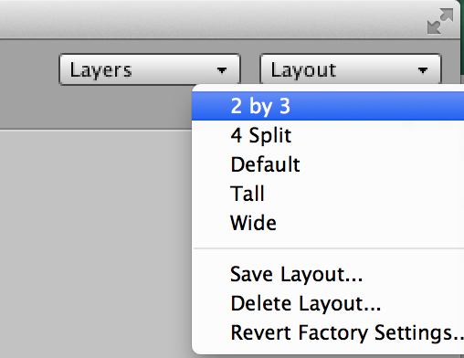
 図1.4: 必ず**2 by 3**を選択すること

#### プロジェクトビューのレイアウト変更

プロジェクトビュー右上の「**≡**」をクリックして**One Column
Layout**を選択します。

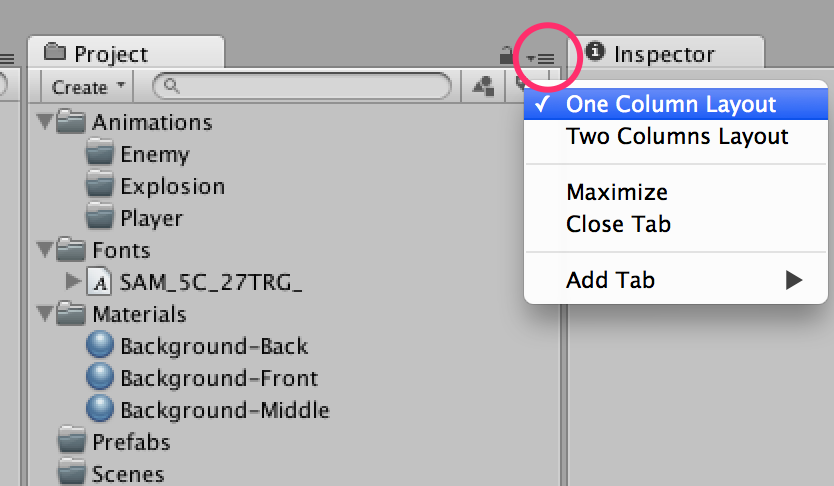
 図1.5:

### ビルドターゲットの変更

今回は**WebPlayer**用にゲームを作成します。

`File -> Build Settings...`を選択して**Project
Settings**ウィンドウを開きましょう。

デフォルトでは**PC, Mac & Linux
Standalone**の横にUnityロゴマークがあるかと思います。図1.6の手順でプラットフォームをWebPlayerへ切り替えましょう。

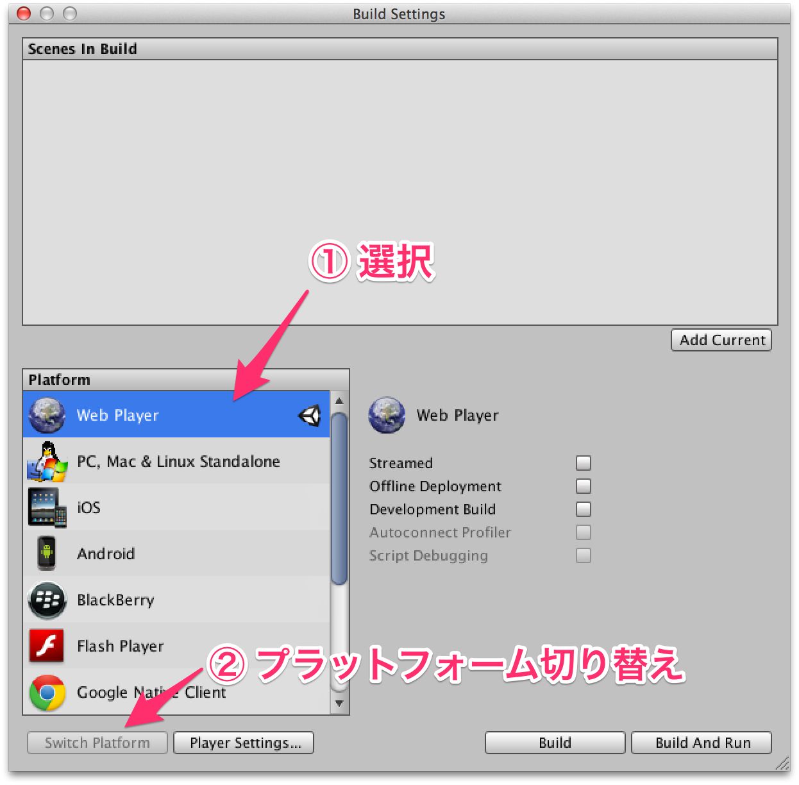
 図1.6:

### ゲーム画面サイズの変更

ゲーム画面サイズを**600 x
450**に変更します。`Edit -> Project Settings -> Player`を選択して**Player
Settings**を開きます。

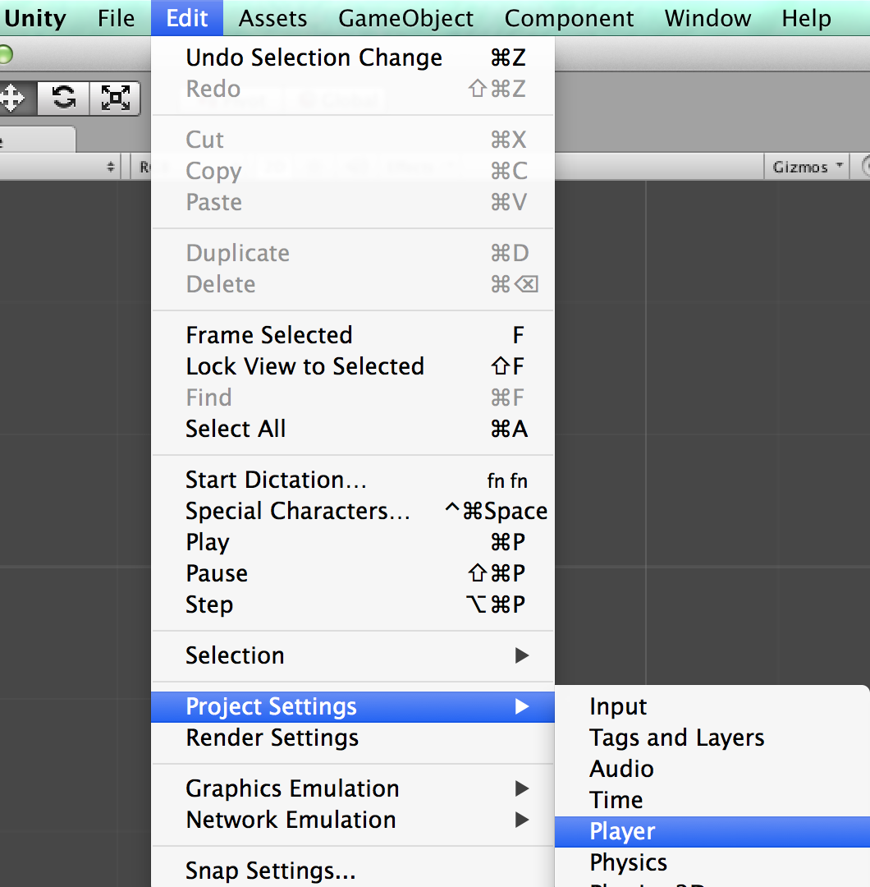
 図1.7:

**Default Screen Width**を**600**に、**Default Screen
Height**を**450**にしてください。

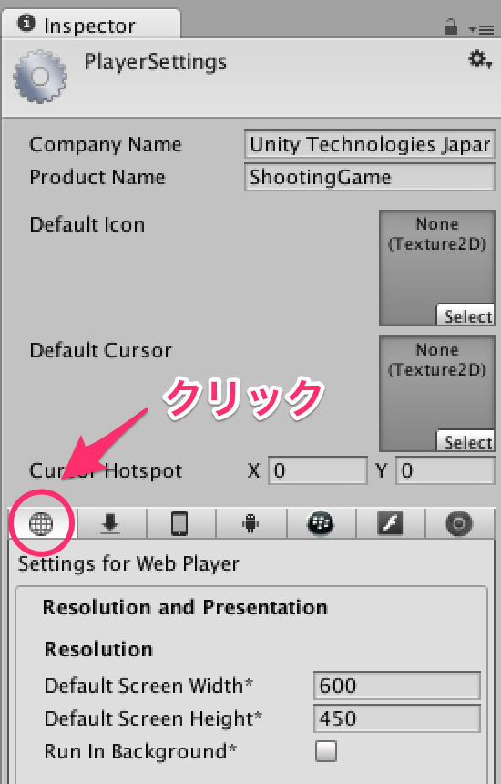
 図1.8: WebPlayerのPlayerSettingsを選択している状態

次にゲームビューにスクリーンサイズを適用するため、ゲームビューの左上のボタンをクリックし、**Web
(600x450)**を選択してください。

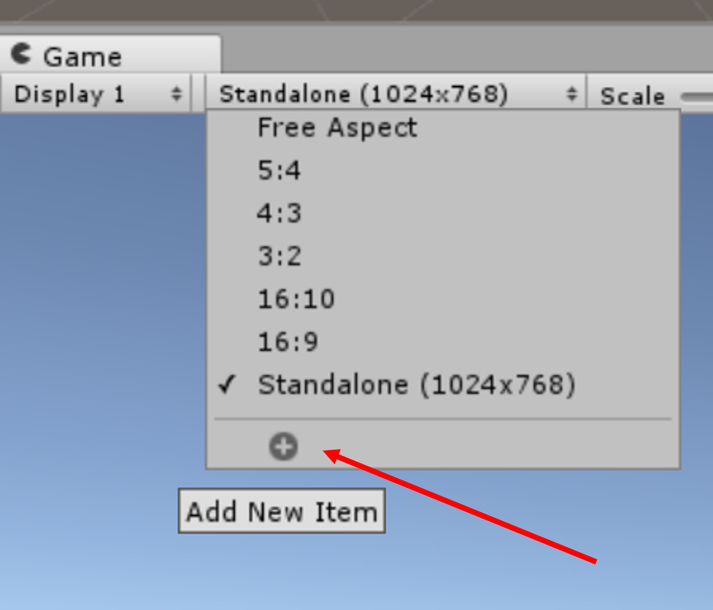
 図1.9:

### 2Dモードの確認

シーンビューの上部にある**2D**ボタンが押されていることを確認して下さい。

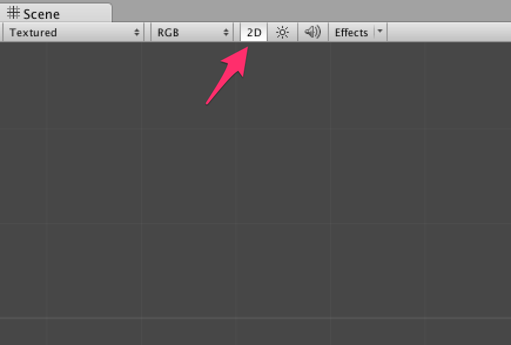

1.5　環境設定終わり
------------------------------------------

Unityを初めて触る方には慣れない作業かもしれませんがUnityを快適に使うための第一歩です。

今回はチュートリアルという特性上このような設定にしましたが、必ずしもこうしなければならないというわけではありません。

チュートリアルが終わったら自分が扱いやすいようにカスタマイズしていきましょう。