### **Sprite (スプライト)**

スプライトは2Dゲームで登場するキャラクターやアイテムなどの2Dのグラフィックスオブジェクトことを指します。
詳しくはドキュメントの[Sprite](http://docs.unity3d.com/ja/current/ScriptReference/Sprite.html)、[SpriteRenderer](https://docs.unity3d.com/jp/current/Manual/class-SpriteRenderer.html)を御覧ください。

1.1　Sprite Editor（スプライトエディター）で1枚のテクスチャから複数のスプライトを作成する
----------------------------------------------------------------------------------------------------------------

プロジェクトビューで`Sprites/Spaceship`フォルダにある**Spaceship**を選択してください。

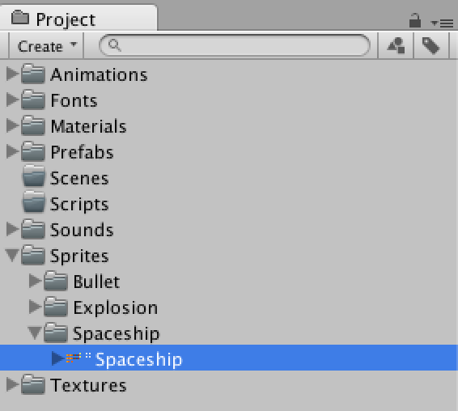
 図1.1: マウスカーソルでテクスチャのSpaceshipを選択した状態。

### Texture Import Settings の確認

2Dモード時にテクスチャをインポートしていれば既にSprite（スプライト）としてインポートされているはずです。
もし**Texture
Type**がTexture（テクスチャ）になっている場合は図1.2のようにSpriteへ変更して**Apply**ボタンを押しましょう。

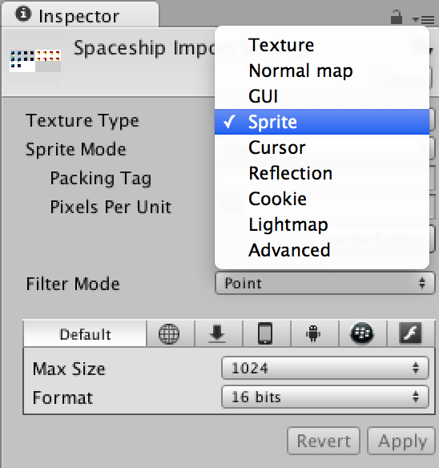
 図1.2:

1つのTextureに複数のSpriteがある場合はTexture Import Settingsの**Sprite
Mode**を**Multiple**に、**Pixels Per Units**を**50**に変更します。

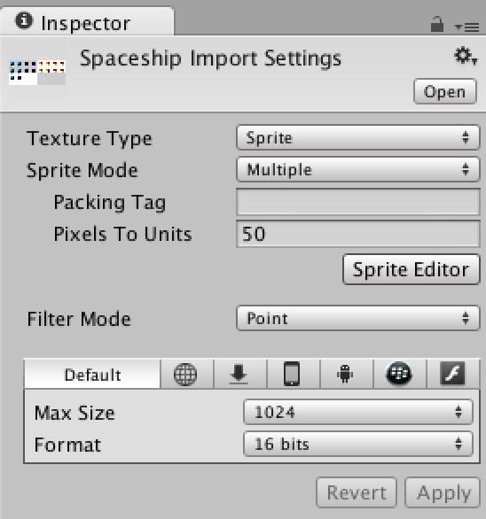
 図1.3:

### Pixels Per Units

Unityでは長さの単位を**Unit
(ユニット)**と表します。更に細かく言えば1ユニットは1メートルです。
「Pixels Per Units」はピクセルとユニットの関係性を表すものです。
#### Pixels Per Unitsが1の時

1ピクセルの大きさが1ユニットと同じになります。

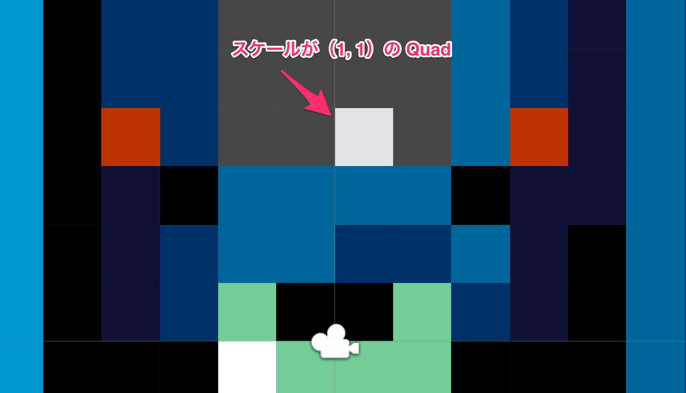

#### Pixels Per Unitsが100の時

100ピクセルの大きさが1ユニットと同じになります。

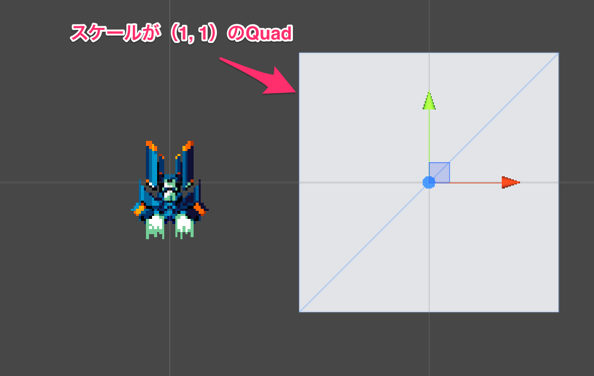

Texture Import
Settingsの**「SpriteEditor」**ボタンを押してSpriteEditorを開いてみましょう。

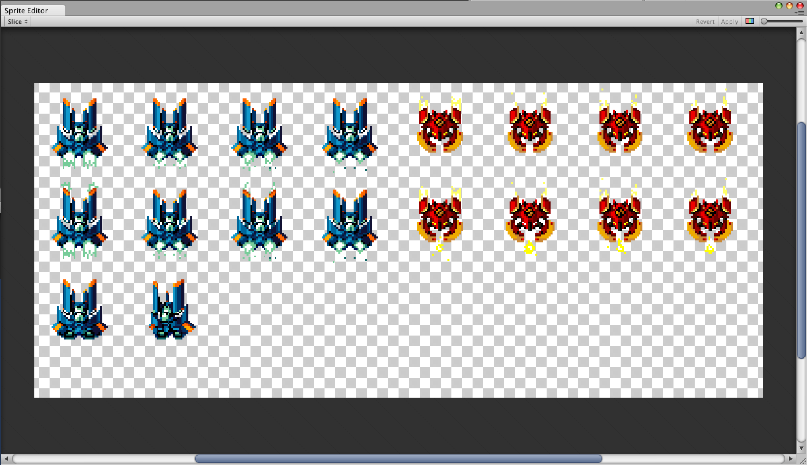
 図1.4:

### **「SpriteEditor」 (スプライトエディター)**

スプライトはひとつのグラフィック要素しか含まない場合もありますが、複数のグラフィックをひとつのテクスチャに含めたほうが効率が良いです。そこで、スプライトエディターで複数のスプライトを作成します。
詳しくはドキュメントの[SpriteEditor](http://docs.unity3d.com/ja/current/Manual/SpriteEditor.html)を御覧ください。

### Grid By Cell Size（セルサイズ単位のグリッド）で分割

テクスチャから複数のスプライトを作成します。左上のSlice（スライス）をクリックしてください。
TypeをAutomatic（オートマチック）からGrid By Cell Sizeに変更します。

 図1.5:

**Pixel Size**を**X 48 Y 48**に変更します。

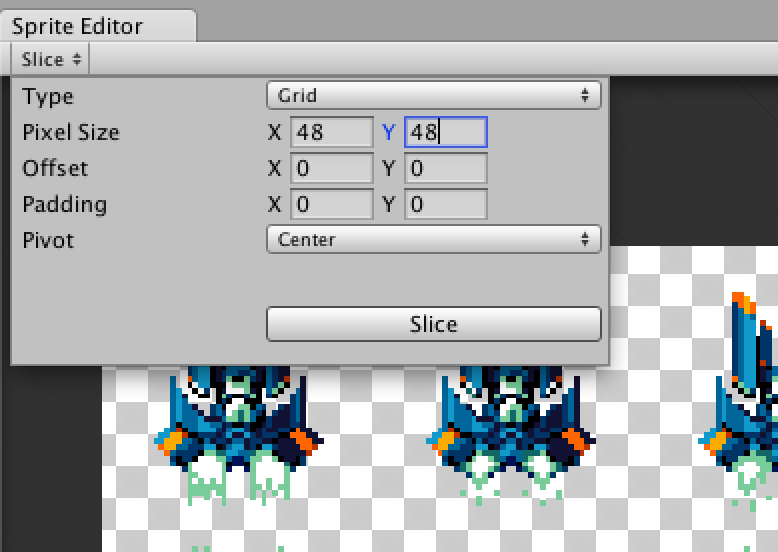
 図1.6:

**Slice**ボタンを押してテクスチャに枠線が付いたことを確認し**Apply**ボタンを押して反映します。

 図1.7:

Project View（プロジェクト ビュー）で図1.8のようになっていればOKです。

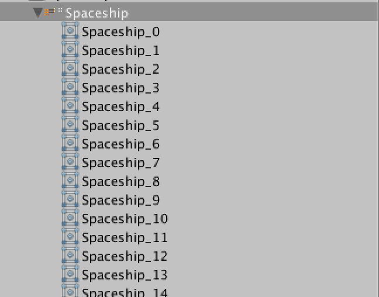
 図1.8:

1.2　自機（Player（プレイヤー））のアニメーション
------------------------------------------------------------------------

 図1.9のようなアニメーションをUnity上で作成します。

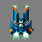
 図1.9: GIFファイルです

### Animation Controller（アニメーションコントローラー）とAnimation Clip（アニメーションクリップ）ファイルの作成

複数のSpriteをScene View（シーンビュー）にDrag & Drop（ドラッグ アンド
ドロップ）すると自動でAnimatorControllerとAnimationClipファイルが作られます。
今回は**Spaceship\_0**から**Spaceship\_3**までの4つを選択し、シーンビューにドラッグ&ドロップしましょう。

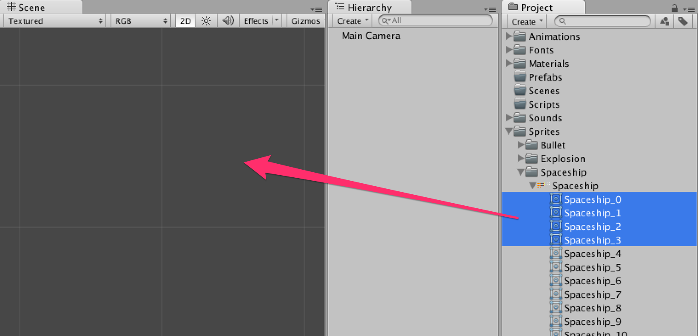
 図1.10:

するとAnimation Clip ファイルと対応するAnimationController ファイルがSpaceshipのフォルダに作成されます。
AnimationController ファイルの名前を`Player`に、Animation Clipのファイルの名前を`Normal`に変更して、
`Animations/Player`フォルダにDrag & Dropして移動しましょう。

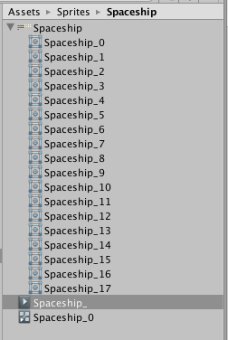
 図1.11: SpaceshipのフォルダにAnimation ClipとAnimationControllerが作成される

ゲームオブジェクトとAnimationControllerそれぞれの`Spaceship_0`の名前を`Player`に変更します。

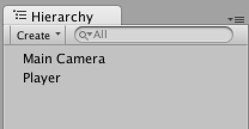
 図1.12:

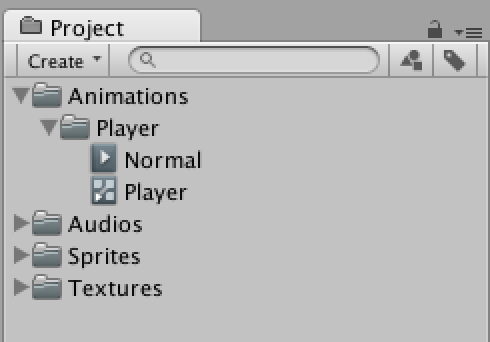
 図1.13:

### ゲームオブジェクトの名前を変更する

ゲームオブジェクトの名前を変更するには2通りの方法があります。 

1.インスペクター上で名前を変更する
ゲームオブジェクトを選択するとインスペクターに様々な情報が表示されます。インスペクターの上部に名前が編集可能な状態で表示されているので変更した後、Enterで名前の更新を行います。

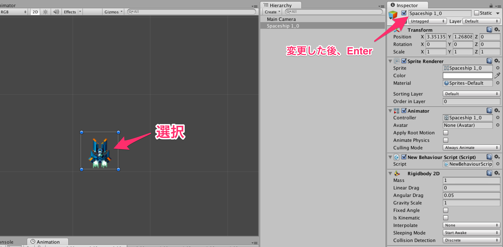
 図1.14:

2\. ヒエラルキー上で名前を変更する
ヒエラルキー上でゲームオブジェクトを選択し、Enterを押すと名前の編集モードになります。名前を変更した後、Enterで名前の更新を行います。

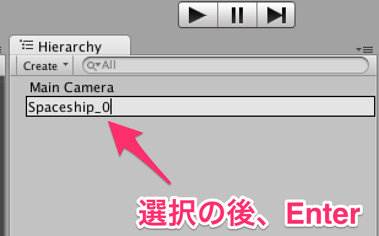
 図1.15:

さて、もう既にスプライトアニメーションは完成しています。
プレイボタンを押してゲームを再生してみましょう。

1.3　敵（Enemy（エネミー））のアニメーション
-------------------------------------------------------------------

 図1.16のようなアニメーションをUnity上で作成します。

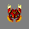
 図1.16: GIFファイルです

同じように**Spaceship\_4**から**Spaceship\_7**までの4つを選択し、シーンビューにドラッグ&ドロップしてAnimatorControllerとAnimationClipファイルを作成してください。

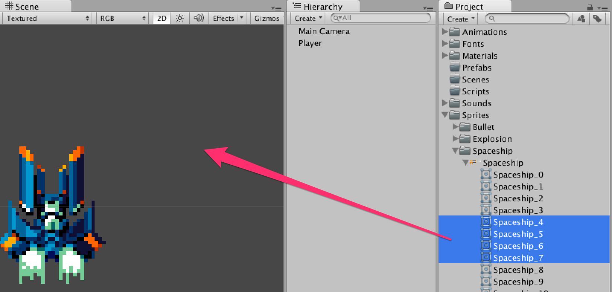
 図1.17:

名前を**Enemy**とします。

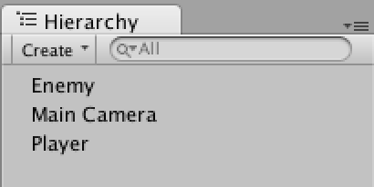
 図1.18:

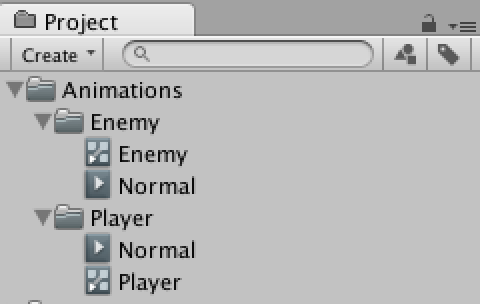
 図1.19:

1.4　弾の作成
------------------------------------

`Bullet`のSprite ModeをMultipleにしてSprite
Editorを開きましょう。 TypeはGrid By Cell SizeでPixel Sizeを**X 16 Y 16**とします。

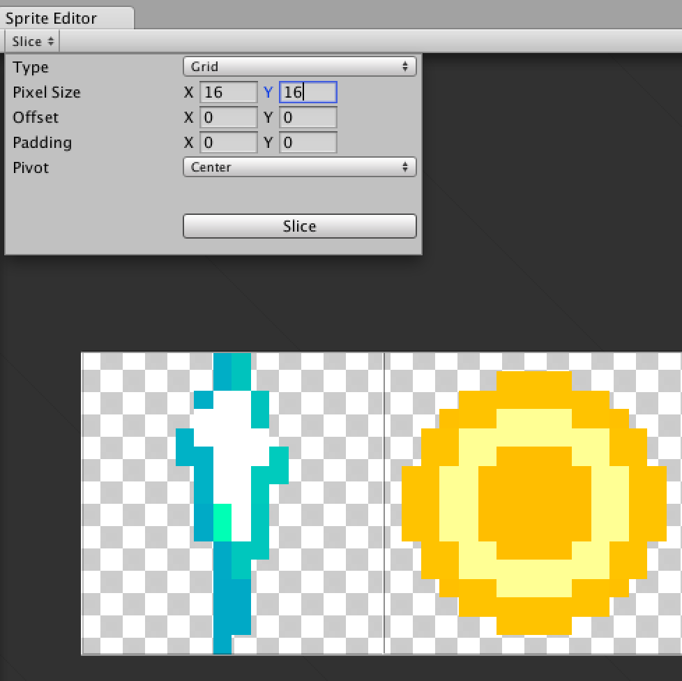
 図1.20:

スライスしたら**Apply**ボタンを押しましょう。
また、Pixels Per Unitsを100に変更します。（弾のスケールを小さくします）

1.5　爆発のアニメーション
------------------------------------------------

このようなアニメーションを作成します。

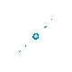
 図1.21: GIFファイルです

`Explosion`のSprite ModeをMultipleにしてSprite
Editorを開きましょう。 TypeはGrid By Cell SizeでPixel Sizeを**X 80 Y 80**とします。
スライスしたら**Apply**ボタンを押しましょう。

 図1.22:

同じように**Explosion\_0**から**Explosion\_10**までの11つを選択し、シーンビューにドラッグ&ドロップしてAnimatorControllerとAnimationClipファイルを作成してください。アニメーション名は`Explode`にします。

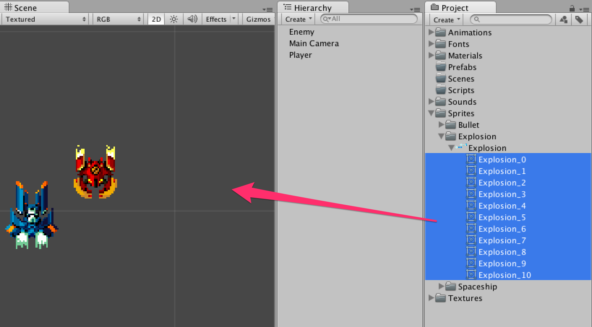
 図1.23:

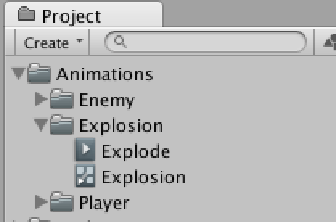
 図1.24:

### Prefabにする

今まで作成した**「Player」**、**「Enemy」**、**「Explosion」**を**Prefab**ファイルとして保存します。
`Prefabs`フォルダを作成し、フォルダに向けてゲームオブジェクトを**１つずつ**ドラッグ＆ドロップします。

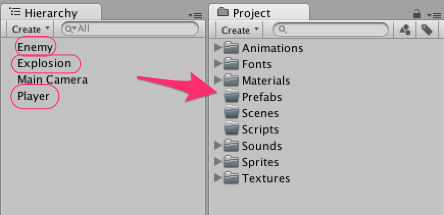
 図1.25:

3つともPrefabにしたらシーン上にあるゲームオブジェクトは削除しましょう。
ゲームオブジェクトの上で右クリックをしてメニューを表示します。**Delete**を選択してください。

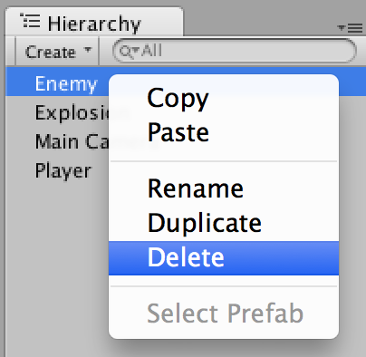

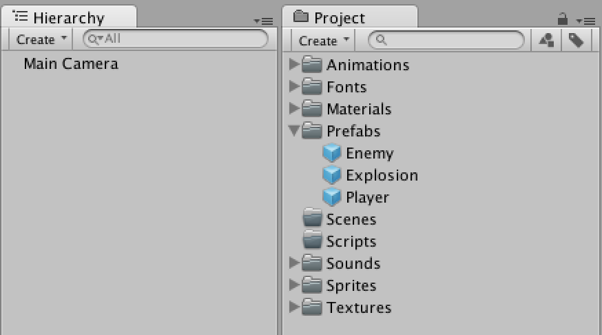

### Prefabとは？

 図1.26:

詳しくはドキュメントの[Prefabs](http://docs.unity3d.com/ja/current/Manual/Prefabs.html)を御覧ください。

### 第01回終わり

今回はここで終了です。つまずいてしまった方はプロジェクトファイルをダウンロードして新たな気持ちで次の回へ進みましょう。

[今回のプロジェクトファイルをダウンロード](project/game_01_ShootingGame.zip)
