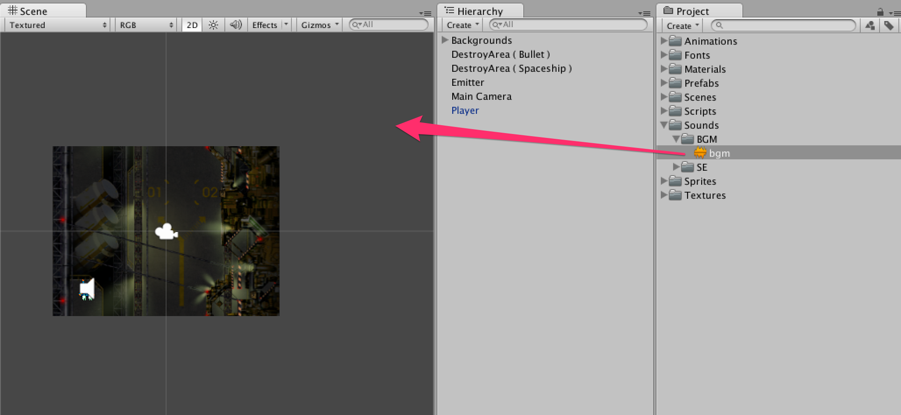
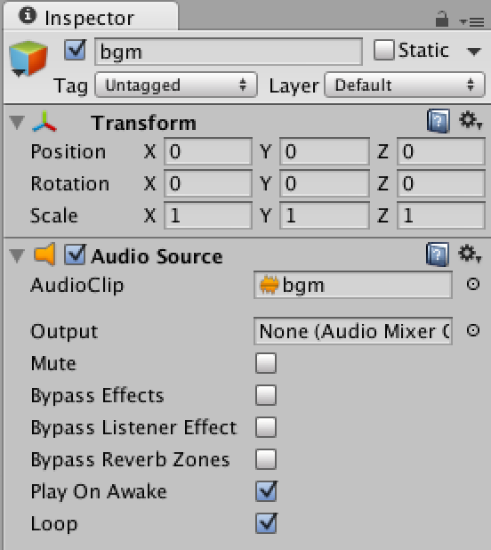
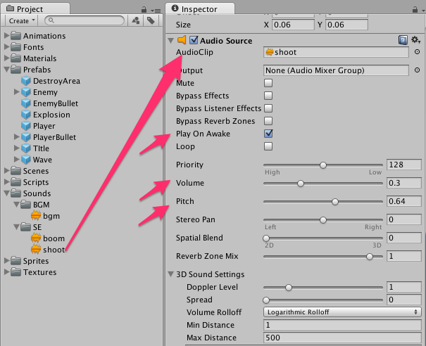

前章で既にゲームとしての必要な実装はほぼ終わっています。
この章では、プレイヤがー弾を撃った時の音や爆発した時の音、さらにゲームのBGMを実装しましょう。

8.1　BGMを付ける
---------------------------------------

### 3D Sound

ゲームで発せられる音は**Main Camera**にアタッチされている**Audio
Listener**を通して、スピーカーなどから音が出ます。 3D
Soundであれば、音が発した場所と**Audio
Listener**の距離が考慮され、遠ければ遠いほど音が小さくなります。 3D
Soundでなければ2D Soundとなり、音が発した場所と**Audio
Listener**の距離は考慮されず、一定の音量となります。


bgmファイルをシーンビューへドラッグ＆ドロップします。





作成されたbgmゲームオブジェクトを選択し、インスペクターにある**Loop**にチェックを入れます。





**これからBGMを鳴らすので音量に注意してください。**
ゲームを再生してみてください。ゲーム開始と同時にBGMが再生されるはずです。

8.2　プレイヤーにショット音をつける
----------------------------------------------------------

次はプレイヤーが弾を撃った時のショット音を実装します。
Playerゲームオブジェクトに**Audio
Source**コンポーネントをアタッチしてください。
アタッチしたら必要なパラメータを設定していきます。 Audio
Clipには`Sounds/SE`にある**shoot**を使用します。ドラッグ＆ドロップして格納してください。
**Play On
Awake**のチェックを外し、ゲームオブジェクト作成時に音を鳴らさないようにします。
BGMと音の大きさが同じで少し聞きづらいので**Volumeを0.3**にします。
最後に**Pitchを0.64**にしましょう。





ショット音をスクリプトから再生します。


Player.cs

```cs
using UnityEngine;
using System.Collections;

public class Player : MonoBehaviour
{
	// Spaceshipコンポーネント
	Spaceship spaceship;
	
	IEnumerator Start ()
	{
		// Spaceshipコンポーネントを取得
		spaceship = GetComponent<Spaceship> ();
		
		while (true) {
			
			// 弾をプレイヤーと同じ位置/角度で作成
			spaceship.Shot (transform);
			
			// ショット音を鳴らす
			GetComponent<AudioSource>().Play();
			
			// shotDelay秒待つ
			yield return new WaitForSeconds (spaceship.shotDelay);
		}
	}
	
	void Update ()
	{
		// 右・左
		float x = Input.GetAxisRaw ("Horizontal");
		
		// 上・下
		float y = Input.GetAxisRaw ("Vertical");
		
		// 移動する向きを求める
		Vector2 direction = new Vector2 (x, y).normalized;
		
		// 移動
		spaceship.Move (direction);
	}
	
	// ぶつかった瞬間に呼び出される
	void OnTriggerEnter2D (Collider2D c)
	{
		// レイヤー名を取得
		string layerName = LayerMask.LayerToName(c.gameObject.layer);
		
		// レイヤー名がBullet (Enemy)の時は弾を削除
		if( layerName == "Bullet (Enemy)")
		{
			// 弾の削除
			Destroy(c.gameObject);
		}
		
		// レイヤー名がBullet (Enemy)またはEnemyの場合は爆発
		if( layerName == "Bullet (Enemy)" || layerName == "Enemy")
		{
			// 爆発する
			spaceship.Explosion();
			
			// プレイヤーを削除
			Destroy (gameObject);
		}
	}
}
```


ゲームを再生してみてください。弾を撃つごとにショット音がなっているはずです。

8.3　爆発音を付ける
------------------------------------------

最後に爆発した時の爆発音を実装します。
`Sounds/SE`にある**boom**をExplosionのプレハブにアタッチしてください。


これで爆発した時に爆発音がなるはずです。

### 第08回終わり

今回はここで終了です。つまずいてしまった方はプロジェクトファイルをダウンロードして新たな気持ちで次の回へ進みましょう。

[今回のプロジェクトファイルをダウンロード](project/game_08_ShootingGame.zip)
